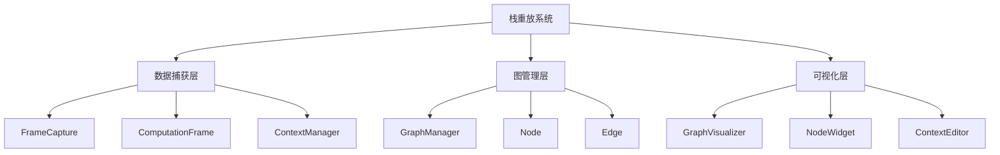

# 栈重放系统设计与实现

基于需求分析，我将设计一个完整的栈重放系统，包含数据捕获、图结构管理和可视化界面三个核心部分。

## 系统架构设计



## 核心组件实现

### 1. 数据捕获层

```python
import functools
import contentvars
import inspect

class ComputationFrame:
    def __init__(self, func, args, kwargs):
        self.id = id(self)
        self.func = func
        self.func_name = func.__name__
        self.module = func.__module__
        self.args = args
        self.kwargs = kwargs
        self.result = None
        self.exception = None
        self.context = {}
        self.children = []
        self.parent = None
        
    def __repr__(self):
        return f"<ComputationFrame {self.func_name} at {hex(self.id)}>"

class FrameCapture:
    def __init__(self, modules=None):
        self.root = None
        self.current_frame = None
        self.frames = {}
        self.modules = modules
        self.context_manager = contentvars.ContextManager()
        
    def capture(self, func):
        """装饰器：捕获函数执行信息"""
        @functools.wraps(func)
        def wrapper(*args, **kwargs):
            # 如果指定了模块但当前模块不在列表中，则不捕获
            if self.modules and func.__module__ not in self.modules:
                return func(*args, **kwargs)
                
            # 创建新的计算帧
            frame = ComputationFrame(func, args, kwargs)
            self.frames[frame.id] = frame
            
            # 设置父子关系
            if not self.root:
                self.root = frame
            else:
                frame.parent = self.current_frame
                self.current_frame.children.append(frame)
                
            # 捕获当前上下文
            frame.context = self.context_manager.capture_context()
            
            # 执行函数
            self.current_frame = frame
            try:
                frame.result = func(*args, **kwargs)
            except Exception as e:
                frame.exception = e
                raise
            finally:
                self.current_frame = frame.parent
                
            return frame.result
        return wrapper
    
    def get_frame(self, frame_id):
        return self.frames.get(frame_id)
    
    def get_frame_tree(self):
        return self._traverse_tree(self.root)
    
    def _traverse_tree(self, frame):
        """深度优先遍历树结构"""
        node = {
            'id': frame.id,
            'name': frame.func_name,
            'module': frame.module,
            'children': [self._traverse_tree(child) for child in frame.children]
        }
        return node
```

### 2. 图管理层

```python
import networkx as nx

class GraphManager:
    def __init__(self, frame_capture):
        self.graph = nx.DiGraph()
        self.frame_capture = frame_capture
        self.build_graph()
        
    def build_graph(self):
        """从捕获的帧构建图结构"""
        self._add_node(self.frame_capture.root)
        
    def _add_node(self, frame):
        """递归添加节点"""
        self.graph.add_node(frame.id, frame=frame)
        
        for child in frame.children:
            self.graph.add_edge(frame.id, child.id)
            self._add_node(child)
    
    def get_node(self, node_id):
        return self.graph.nodes.get(node_id, {}).get('frame')
    
    def replay_node(self, node_id, new_args=None, new_kwargs=None):
        """重放指定节点"""
        node = self.get_node(node_id)
        if not node:
            return None
            
        # 保存原始上下文
        original_context = node.context.copy()
        
        # 应用新参数（如果有）
        if new_args is not None:
            node.args = new_args
        if new_kwargs is not None:
            node.kwargs = new_kwargs
        
        # 执行重放
        with self.frame_capture.context_manager.restore_context(node.context):
            try:
                node.result = node.func(*node.args, **node.kwargs)
                node.exception = None
            except Exception as e:
                node.result = None
                node.exception = e
        
        # 恢复原始上下文
        node.context = original_context
        return node
    
    def replay_subtree(self, node_id, new_args=None, new_kwargs=None):
        """重放指定节点及其子树"""
        node = self.get_node(node_id)
        if not node:
            return None
            
        # 重放当前节点
        self.replay_node(node_id, new_args, new_kwargs)
        
        # 递归重放子节点
        for child_id in self.graph.successors(node_id):
            self.replay_subtree(child_id)
        
        return node
    
    def add_node(self, parent_id, func, args, kwargs):
        """在指定父节点后添加新节点"""
        parent = self.get_node(parent_id)
        if not parent:
            return None
            
        # 创建新节点
        new_frame = ComputationFrame(func, args, kwargs)
        self.frame_capture.frames[new_frame.id] = new_frame
        
        # 添加到图
        self.graph.add_node(new_frame.id, frame=new_frame)
        
        # 获取原父节点的子节点
        children = list(self.graph.successors(parent_id))
        
        # 移除原父节点到子节点的边
        for child_id in children:
            self.graph.remove_edge(parent_id, child_id)
            
        # 添加新边
        self.graph.add_edge(parent_id, new_frame.id)
        for child_id in children:
            self.graph.add_edge(new_frame.id, child_id)
            
        # 更新计算帧关系
        new_frame.parent = parent
        parent.children = [c for c in parent.children if c.id not in children]
        parent.children.append(new_frame)
        new_frame.children = [self.get_node(cid) for cid in children]
        
        return new_frame
    
    def remove_node(self, node_id):
        """删除指定节点"""
        node = self.get_node(node_id)
        if not node or not node.parent:
            return None
            
        # 获取父节点和子节点
        parent = node.parent
        children = list(self.graph.successors(node_id))
        
        # 更新图结构
        self.graph.remove_node(node_id)
        
        # 重新连接父节点和子节点
        for child_id in children:
            self.graph.add_edge(parent.id, child_id)
            
        # 更新计算帧关系
        parent.children = [c for c in parent.children if c.id != node_id]
        parent.children.extend([self.get_node(cid) for cid in children])
        
        # 从捕获器中移除
        del self.frame_capture.frames[node_id]
        
        return node
```

### 3. 可视化界面 (PyQtGraph)

```python
import sys
import pyqtgraph as pg
from pyqtgraph.Qt import QtCore, QtGui, QtWidgets

class NodeWidget(QtWidgets.QGraphicsItem):
    def __init__(self, node_data, graph_manager):
        super().__init__()
        self.node_data = node_data
        self.graph_manager = graph_manager
        self.setFlag(QtWidgets.QGraphicsItem.ItemIsMovable)
        self.setFlag(QtWidgets.QGraphicsItem.ItemSendsGeometryChanges)
        
        # 节点样式
        self.width = 100
        self.height = 60
        self.color = QtGui.QColor(70, 130, 180)
        
        # 文本样式
        self.text = node_data['name']
        self.font = QtGui.QFont("Arial", 10)
        
    def boundingRect(self):
        return QtCore.QRectF(-self.width/2, -self.height/2, self.width, self.height)
    
    def paint(self, painter, option, widget):
        # 绘制背景
        painter.setBrush(QtGui.QBrush(self.color))
        painter.setPen(QtGui.QPen(QtCore.Qt.black, 1))
        painter.drawRoundedRect(-self.width/2, -self.height/2, 
                              self.width, self.height, 10, 10)
        
        # 绘制文本
        painter.setFont(self.font)
        painter.setPen(QtGui.QPen(QtCore.Qt.white))
        painter.drawText(-self.width/2, -self.height/2, 
                       self.width, self.height, 
                       QtCore.Qt.AlignCenter, self.text)
    
    def contextMenuEvent(self, event):
        menu = QtWidgets.QMenu()
        
        # 重放操作
        replay_action = menu.addAction("重放节点")
        replay_subtree_action = menu.addAction("重放子树")
        edit_replay_action = menu.addAction("修改参数后重放")
        
        # 节点操作
        add_node_action = menu.addAction("添加节点")
        remove_node_action = menu.addAction("删除节点")
        
        action = menu.exec_(event.screenPos())
        
        if action == replay_action:
            self.graph_manager.replay_node(self.node_data['id'])
        elif action == replay_subtree_action:
            self.graph_manager.replay_subtree(self.node_data['id'])
        elif action == edit_replay_action:
            self.open_edit_dialog()
        elif action == add_node_action:
            self.open_add_node_dialog()
        elif action == remove_node_action:
            self.graph_manager.remove_node(self.node_data['id'])
    
    def open_edit_dialog(self):
        # 打开参数编辑对话框
        dialog = ContextEditor(self.node_data, self.graph_manager)
        dialog.exec_()
    
    def open_add_node_dialog(self):
        # 打开添加节点对话框
        dialog = AddNodeDialog(self.node_data, self.graph_manager)
        dialog.exec_()

class GraphVisualizer(QtWidgets.QMainWindow):
    def __init__(self, graph_manager):
        super().__init__()
        self.graph_manager = graph_manager
        self.setWindowTitle("栈重放系统")
        self.resize(1200, 800)
        
        # 创建图形视图
        self.view = pg.GraphicsView()
        self.setCentralWidget(self.view)
        
        # 创建场景
        self.scene = QtWidgets.QGraphicsScene()
        self.view.setScene(self.scene)
        
        # 布局设置
        self.layout = pg.GraphicsLayout()
        self.view.setCentralItem(self.layout)
        
        # 绘制图
        self.draw_graph()
        
    def draw_graph(self):
        # 清除现有内容
        self.scene.clear()
        
        # 获取图结构
        graph = self.graph_manager.graph
        
        # 创建节点位置布局
        pos = nx.spring_layout(graph)
        
        # 添加节点
        node_widgets = {}
        for node_id in graph.nodes:
            node_data = graph.nodes[node_id]
            widget = NodeWidget({
                'id': node_id,
                'name': node_data['frame'].func_name
            }, self.graph_manager)
            
            x, y = pos[node_id]
            widget.setPos(x * 300, y * 300)
            self.scene.addItem(widget)
            node_widgets[node_id] = widget
        
        # 添加边
        for source, target in graph.edges:
            source_widget = node_widgets[source]
            target_widget = node_widgets[target]
            
            line = QtWidgets.QGraphicsLineItem(
                source_widget.pos().x(), source_widget.pos().y(),
                target_widget.pos().x(), target_widget.pos().y()
            )
            line.setPen(pg.mkPen('w', width=2))
            self.scene.addItem(line)

class ContextEditor(QtWidgets.QDialog):
    def __init__(self, node_data, graph_manager):
        super().__init__()
        self.node_data = node_data
        self.graph_manager = graph_manager
        self.setWindowTitle("编辑参数")
        self.setup_ui()
    
    def setup_ui(self):
        layout = QtWidgets.QVBoxLayout()
        
        # 获取节点
        node = self.graph_manager.get_node(self.node_data['id'])
        
        # 创建参数编辑器
        self.arg_editors = {}
        
        # 位置参数
        for i, arg in enumerate(node.args):
            label = QtWidgets.QLabel(f"参数 {i+1}:")
            editor = QtWidgets.QLineEdit(str(arg))
            layout.addWidget(label)
            layout.addWidget(editor)
            self.arg_editors[f"arg_{i}"] = editor
        
        # 关键字参数
        for key, value in node.kwargs.items():
            label = QtWidgets.QLabel(f"{key}:")
            editor = QtWidgets.QLineEdit(str(value))
            layout.addWidget(label)
            layout.addWidget(editor)
            self.arg_editors[key] = editor
        
        # 按钮
        button_box = QtWidgets.QDialogButtonBox(
            QtWidgets.QDialogButtonBox.Ok | QtWidgets.QDialogButtonBox.Cancel
        )
        button_box.accepted.connect(self.accept)
        button_box.rejected.connect(self.reject)
        layout.addWidget(button_box)
        
        self.setLayout(layout)
    
    def accept(self):
        # 获取编辑后的参数
        new_args = []
        new_kwargs = {}
        
        # 处理位置参数
        i = 0
        while f"arg_{i}" in self.arg_editors:
            try:
                value = eval(self.arg_editors[f"arg_{i}"].text())
                new_args.append(value)
            except:
                new_args.append(self.arg_editors[f"arg_{i}"].text())
            i += 1
        
        # 处理关键字参数
        for key, editor in self.arg_editors.items():
            if key.startswith("arg_"):
                continue
            try:
                value = eval(editor.text())
                new_kwargs[key] = value
            except:
                new_kwargs[key] = editor.text()
        
        # 执行重放
        self.graph_manager.replay_node(
            self.node_data['id'], 
            new_args if new_args else None,
            new_kwargs if new_kwargs else None
        )
        
        super().accept()

class AddNodeDialog(QtWidgets.QDialog):
    def __init__(self, parent_data, graph_manager):
        super().__init__()
        self.parent_data = parent_data
        self.graph_manager = graph_manager
        self.setWindowTitle("添加节点")
        self.setup_ui()
    
    def setup_ui(self):
        layout = QtWidgets.QFormLayout()
        
        # 函数选择
        self.func_combo = QtWidgets.QComboBox()
        # 这里应该填充可用函数列表，简化处理
        self.func_combo.addItems(["func1", "func2", "func3"])
        layout.addRow("函数:", self.func_combo)
        
        # 参数输入
        self.args_edit = QtWidgets.QLineEdit("()")
        layout.addRow("位置参数:", self.args_edit)
        
        self.kwargs_edit = QtWidgets.QLineEdit("{}")
        layout.addRow("关键字参数:", self.kwargs_edit)
        
        # 按钮
        button_box = QtWidgets.QDialogButtonBox(
            QtWidgets.QDialogButtonBox.Ok | QtWidgets.QDialogButtonBox.Cancel
        )
        button_box.accepted.connect(self.accept)
        button_box.rejected.connect(self.reject)
        layout.addRow(button_box)
        
        self.setLayout(layout)
    
    def accept(self):
        # 获取输入
        func_name = self.func_combo.currentText()
        args = eval(self.args_edit.text())
        kwargs = eval(self.kwargs_edit.text())
        
        # TODO: 根据函数名获取实际函数对象
        # 这里简化处理
        def new_func(*args, **kwargs):
            print(f"执行新函数: {func_name}")
            return f"Result of {func_name}"
        
        # 添加节点
        self.graph_manager.add_node(
            self.parent_data['id'],
            new_func,
            args,
            kwargs
        )
        
        super().accept()
```

## 操作流程

1. **程序初始化**
```python
# 创建捕获器（只捕获指定模块的函数）
capture = FrameCapture(modules=['my_module'])

# 装饰需要捕获的函数
@capture.capture
def my_function(arg1, arg2):
    # 函数实现
    result = arg1 + arg2
    return result

# 创建图管理器
graph_manager = GraphManager(capture)
```

2. **运行程序**
```python
# 执行被装饰的函数
result = my_function(10, 20)

# 此时捕获器已经记录了所有执行信息
```

3. **可视化界面**
```python
# 启动可视化界面
app = QtWidgets.QApplication(sys.argv)
visualizer = GraphVisualizer(graph_manager)
visualizer.show()
sys.exit(app.exec_())
```

4. **交互操作**
   - 右键点击节点弹出菜单
   - 选择"重放节点"：使用原始参数重新执行该函数
   - 选择"修改参数后重放"：打开参数编辑器，修改后执行
   - 选择"重放子树"：重新执行该节点及其所有子节点
   - 选择"添加节点"：在当前节点后插入新节点
   - 选择"删除节点"：移除当前节点，重新连接父节点和子节点

## 关键技术点

1. **上下文管理**：
   - 使用`contentvars`库捕获和恢复函数执行的上下文
   - 在重放时精确恢复原始执行环境

2. **图操作**：
   - 使用NetworkX管理复杂的节点关系
   - 支持动态添加、删除节点
   - 维护节点间的依赖关系

3. **可视化交互**：
   - 使用PyQtGraph实现高性能绘图
   - 支持节点拖拽、展开/折叠
   - 右键菜单提供完整操作功能

4. **参数编辑**：
   - 动态生成参数编辑器
   - 支持eval解析复杂数据结构
   - 安全处理用户输入

## 优化方向

1. **性能优化**：
   - 对大图采用分层渲染
   - 实现懒加载子树
   - 优化重放操作的执行效率

2. **功能增强**：
   - 添加时间旅行调试功能
   - 支持断点调试
   - 添加性能分析视图

3. **用户体验**：
   - 实现节点折叠/展开状态持久化
   - 添加搜索和过滤功能
   - 提供多视图布局选项

这个栈重放系统实现了核心需求，包括函数执行捕获、任意节点重放、参数修改、节点增删等功能，同时保持了架构的整洁性和可扩展性。