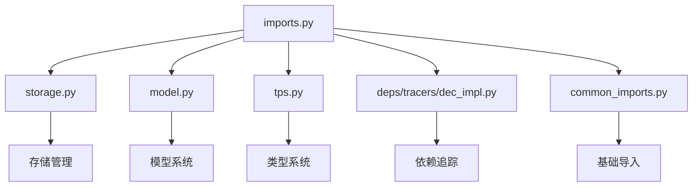

# Imports 导入接口模块

## 概述

Imports 模块是 mandala 框架的对外接口模块，提供了框架核心功能的统一导入入口。该模块简化了用户对框架各组件的访问，通过集中导入的方式提供了清晰的API接口。

## 核心组件导入

### 存储系统

```python
from .storage import Storage, noop
```

**导入组件:**
- `Storage`: 核心存储管理类，提供数据持久化和计算图管理功能
- `noop`: 无操作上下文管理器，用于跳过操作执行

**用途:**
- 提供主要的存储和计算管理接口
- 支持调试模式下的操作跳过功能

### 模型系统

```python
from .model import op, Ignore, NewArgDefault, wrap_atom, ValuePointer
```

**导入组件:**
- `op`: 操作装饰器，用于定义可缓存的计算操作
- `Ignore`: 参数忽略包装器，用于标记不参与哈希计算的参数
- `NewArgDefault`: 新参数默认值包装器，用于处理函数签名变化
- `wrap_atom`: 原子值包装函数，将普通值包装为Ref对象
- `ValuePointer`: 值指针类，用于间接引用对象

**用途:**
- 提供函数装饰和参数处理功能
- 支持计算图的构建和管理

### 类型系统

```python
from .tps import MList, MDict
```

**导入组件:**
- `MList`: Mandala列表类型，支持计算图的列表结构
- `MDict`: Mandala字典类型，支持计算图的字典结构

**用途:**
- 提供框架特定的数据结构类型
- 支持复杂数据结构的计算图表示

### 调试追踪

```python
from .deps.tracers.dec_impl import track
```

**导入组件:**
- `track`: 函数追踪装饰器，用于依赖跟踪和版本控制

**用途:**
- 提供函数执行的依赖追踪功能
- 支持版本控制和代码变更检测

### 调试会话

```python
from .common_imports import sess
```

**导入组件:**
- `sess`: 全局调试会话实例，用于调试过程中的变量捕获和传递

**用途:**
- 提供调试期间的变量管理功能
- 支持开发过程中的调试操作

## 工具函数

### pprint_dict()

```python
def pprint_dict(d) -> str:
    return '\n'.join([f"    {k}: {v}" for k, v in d.items()])
```

**参数:**
- `d`: 要格式化的字典对象

**返回值:**
- `str`: 格式化后的字符串，每行一个键值对

**功能描述:**
- 将字典格式化为易读的多行字符串
- 每个键值对占一行，带有4个空格的缩进
- 适用于调试和日志输出

## 使用示例

### 基本使用

```python
from mandala1.imports import Storage, op, MList, MDict

# 创建存储实例
storage = Storage()

# 定义操作
@op
def add_numbers(a: int, b: int) -> int:
    return a + b

# 使用存储上下文
with storage:
    result = add_numbers(1, 2)
    print(f"计算结果: {storage.unwrap(result)}")

# 使用类型系统
data_list = MList([1, 2, 3, 4, 5])
data_dict = MDict({'key1': 'value1', 'key2': 'value2'})
```

### 高级功能使用

```python
from mandala1.imports import Storage, op, Ignore, NewArgDefault, track

# 使用参数忽略
@op
def process_data(data: list, config: dict = Ignore({'debug': True})):
    # config 参数不参与哈希计算
    return [x * 2 for x in data]

# 使用新参数默认值
@op
def enhanced_function(x: int, y: int = NewArgDefault(10)):
    # 处理函数签名变化
    return x + y

# 使用追踪装饰器
@track
def complex_computation(data):
    # 被追踪的函数
    return sum(data)

# 使用存储系统
storage = Storage()
with storage:
    result1 = process_data([1, 2, 3])
    result2 = enhanced_function(5)
    result3 = complex_computation([1, 2, 3, 4, 5])
```

### 调试功能使用

```python
from mandala1.imports import sess, noop

def debug_example():
    local_var = "调试变量"
    debug_data = [1, 2, 3, 4, 5]
    
    # 捕获当前作用域
    sess.d()
    
    # 在noop模式下执行
    with noop():
        # 操作会被跳过，但函数调用会正常执行
        result = some_operation(debug_data)
        print(f"Noop模式结果: {result}")
    
    # 在其他地方使用捕获的变量
    def another_function():
        sess.dump()
        print(f"导入的变量: {local_var}")
        print(f"导入的数据: {debug_data}")
    
    another_function()
```

### 工具函数使用

```python
from mandala1.imports import pprint_dict

# 格式化字典输出
config = {
    'database_url': 'sqlite:///example.db',
    'debug': True,
    'max_connections': 100,
    'timeout': 30
}

print("配置信息:")
print(pprint_dict(config))

# 输出:
# 配置信息:
#     database_url: sqlite:///example.db
#     debug: True
#     max_connections: 100
#     timeout: 30
```

## 模块依赖关系



## 设计理念

### 统一接口

- 提供单一的导入入口点
- 简化用户对框架组件的访问
- 减少复杂的导入路径

### 功能分组

- 按功能类型组织导入
- 相关功能集中导入
- 便于理解和使用

### 最小化依赖

- 只导入必要的组件
- 避免循环依赖
- 保持模块的轻量级

## 扩展指南

### 添加新的导入组件

```python
# 在适当的位置添加新的导入
from .new_module import NewComponent

# 或者从子模块导入
from .submodule.new_feature import AdvancedFeature
```

### 添加新的工具函数

```python
def new_utility_function(data: Any) -> str:
    """
    新的工具函数
    """
    return str(data)
```

### 重新组织导入

```python
# 可以按功能重新组织导入
# 核心功能
from .storage import Storage, noop
from .model import op

# 类型系统
from .tps import MList, MDict

# 调试工具
from .deps.tracers.dec_impl import track
from .common_imports import sess

# 辅助功能
from .model import Ignore, NewArgDefault, wrap_atom, ValuePointer
```

## 注意事项

1. **导入顺序**: 确保导入的模块没有循环依赖
2. **接口稳定性**: 保持导入接口的稳定性，避免频繁变更
3. **文档同步**: 确保导入的组件都有相应的文档
4. **版本兼容**: 考虑不同版本间的兼容性问题
5. **性能影响**: 避免导入不必要的大型模块

## 相关模块

- `storage.py`: 提供存储和计算管理功能
- `model.py`: 提供模型系统和装饰器
- `tps.py`: 提供类型系统支持
- `deps/tracers/dec_impl.py`: 提供依赖追踪功能
- `common_imports.py`: 提供基础导入和调试支持

Imports 模块是 mandala 框架的入口点，为用户提供了简洁统一的API接口。 