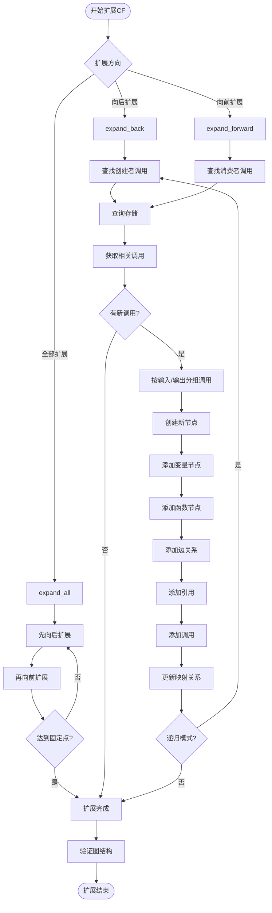
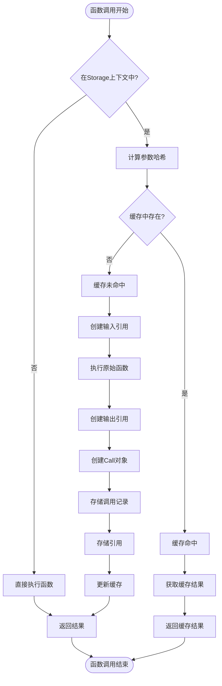
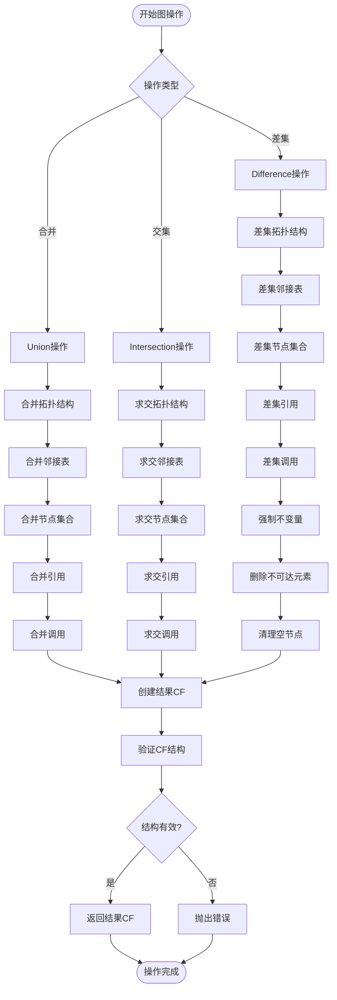
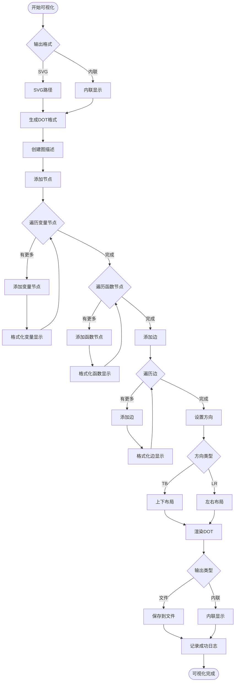

# Mandala框架活动图

## 1. 栈回放完整流程活动图

```mermaid
flowchart TD
    START([开始栈回放演示]) --> INIT[初始化StackReplayDemo]
    INIT --> CREATE_HISTORY[创建计算历史]
    
    CREATE_HISTORY --> PREPARE_DATA[准备测试数据]
    PREPARE_DATA --> EXEC_ORIGINAL[执行原始计算]
    
    EXEC_ORIGINAL --> BATCH_CALC[批量计算函数]
    BATCH_CALC --> LOOP_START{遍历输入列表}
    
    LOOP_START -->|有更多数据| DATA_PROCESS[调用数据处理函数]
    DATA_PROCESS --> MULTIPLY[数据乘以乘数]
    MULTIPLY --> COLLECT_RESULT[收集处理结果]
    COLLECT_RESULT --> LOOP_START
    
    LOOP_START -->|处理完成| AGGREGATE[聚合所有结果]
    AGGREGATE --> CREATE_CF[创建ComputationFrame]
    CREATE_CF --> EXPAND_CF[扩展CF(recursive=True)]
    
    EXPAND_CF --> FIND_FUNC[查找目标函数]
    FIND_FUNC --> CHECK_FUNC{函数存在?}
    
    CHECK_FUNC -->|是| GET_CALLS[获取函数调用列表]
    CHECK_FUNC -->|否| ERROR[记录错误信息]
    ERROR --> END
    
    GET_CALLS --> EXTRACT_PARAMS[提取原始参数]
    EXTRACT_PARAMS --> MODIFY_PARAMS[修改参数]
    MODIFY_PARAMS --> RE_EXECUTE[重新执行函数]
    
    RE_EXECUTE --> NEW_RESULT[生成新结果]
    NEW_RESULT --> CREATE_NEW_CF[创建新的ComputationFrame]
    CREATE_NEW_CF --> EXPAND_NEW_CF[扩展新CF]
    
    EXPAND_NEW_CF --> MERGE_CF[合并ComputationFrame]
    MERGE_CF --> MERGE_SUCCESS{合并成功?}
    
    MERGE_SUCCESS -->|是| VISUALIZE[可视化结果]
    MERGE_SUCCESS -->|否| USE_NEW_CF[使用新CF]
    USE_NEW_CF --> VISUALIZE
    
    VISUALIZE --> GENERATE_SVG[生成SVG文件]
    GENERATE_SVG --> ANALYZE_RESULTS[分析结果]
    ANALYZE_RESULTS --> COMPARE[比较原始和新结果]
    COMPARE --> GENERATE_REPORT[生成分析报告]
    GENERATE_REPORT --> END([演示完成])
```

## 2. ComputationFrame扩展活动图



## 3. 函数执行和缓存活动图



## 4. 图操作活动图



## 5. 可视化生成活动图

