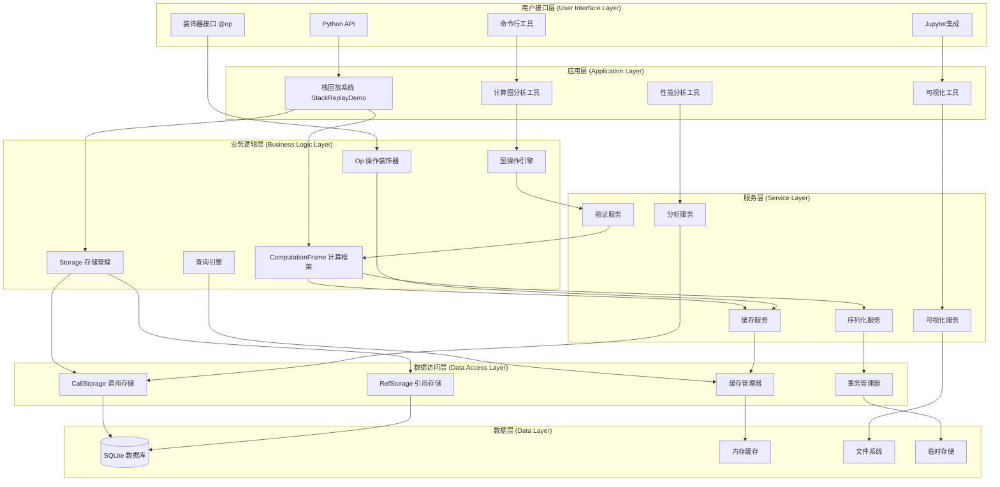
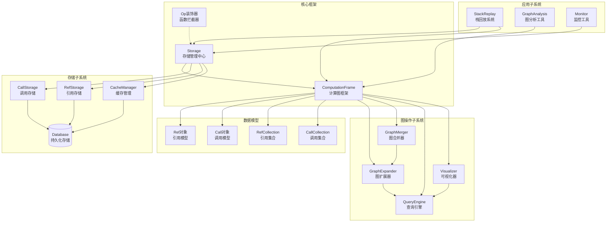
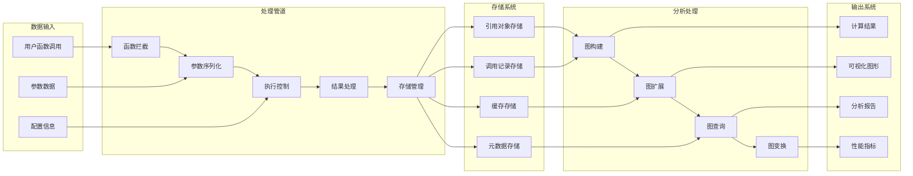
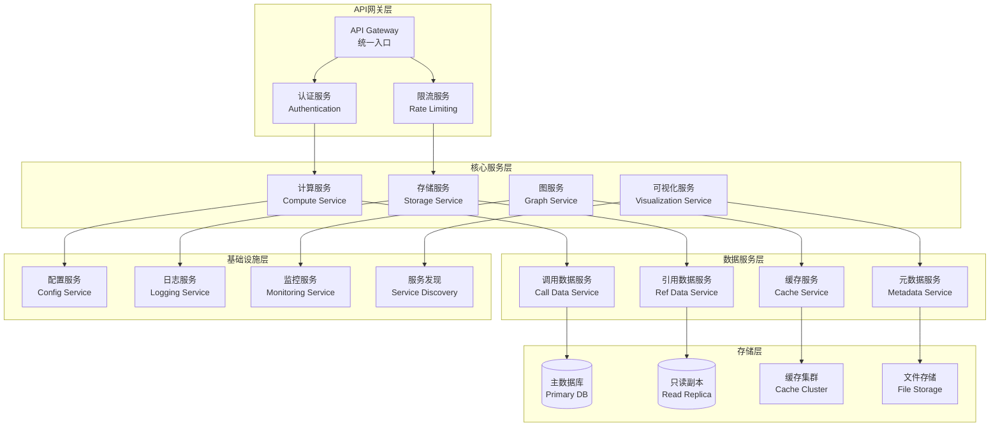
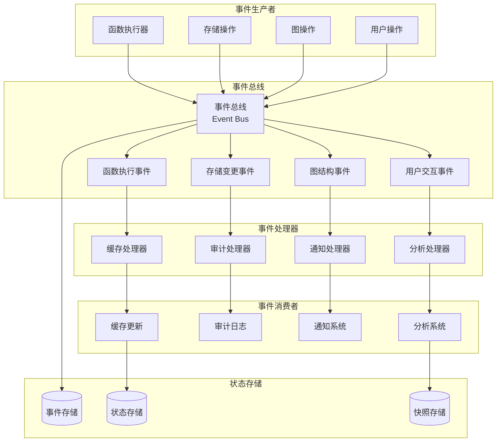
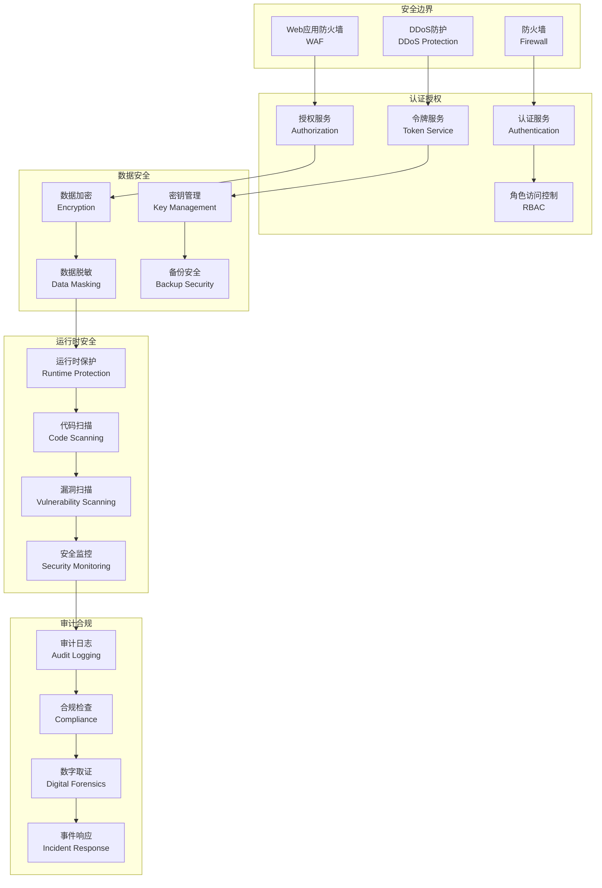

# Mandala框架架构总览

## 1. 系统架构层次图

```mermaid
graph TB
    subgraph "用户接口层 (User Interface Layer)"
        UI1[Python API]
        UI2[装饰器接口 @op]
        UI3[命令行工具]
        UI4[Jupyter集成]
    end
    
    subgraph "应用层 (Application Layer)"
        APP1[栈回放系统 StackReplayDemo]
        APP2[计算图分析工具]
        APP3[可视化工具]
        APP4[性能分析工具]
    end
    
    subgraph "业务逻辑层 (Business Logic Layer)"
        BL1[ComputationFrame 计算框架]
        BL2[Storage 存储管理]
        BL3[Op 操作装饰器]
        BL4[图操作引擎]
        BL5[查询引擎]
    end
    
    subgraph "服务层 (Service Layer)"
        SVC1[缓存服务]
        SVC2[序列化服务]
        SVC3[可视化服务]
        SVC4[分析服务]
        SVC5[验证服务]
    end
    
    subgraph "数据访问层 (Data Access Layer)"
        DAL1[CallStorage 调用存储]
        DAL2[RefStorage 引用存储]
        DAL3[缓存管理器]
        DAL4[事务管理器]
    end
    
    subgraph "数据层 (Data Layer)"
        DATA1[(SQLite 数据库)]
        DATA2[内存缓存]
        DATA3[文件系统]
        DATA4[临时存储]
    end
    
    UI1 --> APP1
    UI2 --> BL3
    UI3 --> APP2
    UI4 --> APP3
    
    APP1 --> BL1
    APP1 --> BL2
    APP2 --> BL4
    APP3 --> SVC3
    APP4 --> SVC4
    
    BL1 --> SVC1
    BL1 --> SVC2
    BL2 --> DAL1
    BL2 --> DAL2
    BL3 --> SVC1
    BL4 --> SVC5
    BL5 --> DAL3
    
    SVC1 --> DAL3
    SVC2 --> DAL4
    SVC3 --> DATA3
    SVC4 --> DAL1
    SVC5 --> BL1
    
    DAL1 --> DATA1
    DAL2 --> DATA1
    DAL3 --> DATA2
    DAL4 --> DATA4
```

## 2. 核心组件交互图

```mermaid
graph TB
    subgraph "核心框架"
        STORAGE[Storage<br/>存储管理中心]
        CF[ComputationFrame<br/>计算图框架]
        OP[Op装饰器<br/>函数拦截器]
    end
    
    subgraph "数据模型"
        REF[Ref对象<br/>引用模型]
        CALL[Call对象<br/>调用模型]
        REFCOL[RefCollection<br/>引用集合]
        CALLCOL[CallCollection<br/>调用集合]
    end
    
    subgraph "存储子系统"
        CALLSTORE[CallStorage<br/>调用存储]
        REFSTORE[RefStorage<br/>引用存储]
        CACHE[CacheManager<br/>缓存管理]
        DB[(Database<br/>持久化存储)]
    end
    
    subgraph "图操作子系统"
        EXPAND[GraphExpander<br/>图扩展器]
        MERGE[GraphMerger<br/>图合并器]
        QUERY[QueryEngine<br/>查询引擎]
        VISUAL[Visualizer<br/>可视化器]
    end
    
    subgraph "应用子系统"
        REPLAY[StackReplay<br/>栈回放系统]
        ANALYSIS[GraphAnalysis<br/>图分析工具]
        MONITOR[Monitor<br/>监控工具]
    end
    
    OP -.-> STORAGE
    STORAGE --> CF
    STORAGE --> CALLSTORE
    STORAGE --> REFSTORE
    STORAGE --> CACHE
    
    CF --> REF
    CF --> CALL
    CF --> REFCOL
    CF --> CALLCOL
    
    CALLSTORE --> DB
    REFSTORE --> DB
    CACHE --> DB
    
    CF --> EXPAND
    CF --> MERGE
    CF --> QUERY
    CF --> VISUAL
    
    REPLAY --> STORAGE
    REPLAY --> CF
    ANALYSIS --> CF
    MONITOR --> STORAGE
    
    EXPAND --> QUERY
    MERGE --> EXPAND
    VISUAL --> QUERY
```

## 3. 数据流架构图

```mermaid
flowchart LR
    subgraph "数据输入"
        INPUT1[用户函数调用]
        INPUT2[参数数据]
        INPUT3[配置信息]
    end
    
    subgraph "处理管道"
        PIPE1[函数拦截]
        PIPE2[参数序列化]
        PIPE3[执行控制]
        PIPE4[结果处理]
        PIPE5[存储管理]
    end
    
    subgraph "存储系统"
        STORE1[调用记录存储]
        STORE2[引用对象存储]
        STORE3[缓存存储]
        STORE4[元数据存储]
    end
    
    subgraph "分析处理"
        ANALYSIS1[图构建]
        ANALYSIS2[图扩展]
        ANALYSIS3[图查询]
        ANALYSIS4[图变换]
    end
    
    subgraph "输出系统"
        OUTPUT1[计算结果]
        OUTPUT2[可视化图形]
        OUTPUT3[分析报告]
        OUTPUT4[性能指标]
    end
    
    INPUT1 --> PIPE1
    INPUT2 --> PIPE2
    INPUT3 --> PIPE3
    
    PIPE1 --> PIPE2
    PIPE2 --> PIPE3
    PIPE3 --> PIPE4
    PIPE4 --> PIPE5
    
    PIPE5 --> STORE1
    PIPE5 --> STORE2
    PIPE5 --> STORE3
    PIPE5 --> STORE4
    
    STORE1 --> ANALYSIS1
    STORE2 --> ANALYSIS1
    STORE3 --> ANALYSIS2
    STORE4 --> ANALYSIS3
    
    ANALYSIS1 --> ANALYSIS2
    ANALYSIS2 --> ANALYSIS3
    ANALYSIS3 --> ANALYSIS4
    
    ANALYSIS1 --> OUTPUT1
    ANALYSIS2 --> OUTPUT2
    ANALYSIS3 --> OUTPUT3
    ANALYSIS4 --> OUTPUT4
```

## 4. 微服务架构图

```mermaid
graph TB
    subgraph "API网关层"
        GATEWAY[API Gateway<br/>统一入口]
        AUTH[认证服务<br/>Authentication]
        RATE_LIMIT[限流服务<br/>Rate Limiting]
    end
    
    subgraph "核心服务层"
        COMPUTE_SVC[计算服务<br/>Compute Service]
        STORAGE_SVC[存储服务<br/>Storage Service]
        GRAPH_SVC[图服务<br/>Graph Service]
        VIS_SVC[可视化服务<br/>Visualization Service]
    end
    
    subgraph "数据服务层"
        CALL_SVC[调用数据服务<br/>Call Data Service]
        REF_SVC[引用数据服务<br/>Ref Data Service]
        CACHE_SVC[缓存服务<br/>Cache Service]
        METADATA_SVC[元数据服务<br/>Metadata Service]
    end
    
    subgraph "基础设施层"
        CONFIG_SVC[配置服务<br/>Config Service]
        LOG_SVC[日志服务<br/>Logging Service]
        MONITOR_SVC[监控服务<br/>Monitoring Service]
        DISCOVERY_SVC[服务发现<br/>Service Discovery]
    end
    
    subgraph "存储层"
        PRIMARY_DB[(主数据库<br/>Primary DB)]
        REPLICA_DB[(只读副本<br/>Read Replica)]
        CACHE_CLUSTER[缓存集群<br/>Cache Cluster]
        FILE_STORAGE[文件存储<br/>File Storage]
    end
    
    GATEWAY --> AUTH
    GATEWAY --> RATE_LIMIT
    AUTH --> COMPUTE_SVC
    RATE_LIMIT --> STORAGE_SVC
    
    COMPUTE_SVC --> CALL_SVC
    STORAGE_SVC --> REF_SVC
    GRAPH_SVC --> CACHE_SVC
    VIS_SVC --> METADATA_SVC
    
    CALL_SVC --> PRIMARY_DB
    REF_SVC --> REPLICA_DB
    CACHE_SVC --> CACHE_CLUSTER
    METADATA_SVC --> FILE_STORAGE
    
    COMPUTE_SVC --> CONFIG_SVC
    STORAGE_SVC --> LOG_SVC
    GRAPH_SVC --> MONITOR_SVC
    VIS_SVC --> DISCOVERY_SVC
```

## 5. 事件驱动架构图

```mermaid
graph TB
    subgraph "事件生产者"
        FUNC_EXEC[函数执行器]
        STORAGE_OPS[存储操作]
        GRAPH_OPS[图操作]
        USER_ACTIONS[用户操作]
    end
    
    subgraph "事件总线"
        EVENT_BUS[事件总线<br/>Event Bus]
        TOPIC1[函数执行事件]
        TOPIC2[存储变更事件]
        TOPIC3[图结构事件]
        TOPIC4[用户交互事件]
    end
    
    subgraph "事件处理器"
        CACHE_HANDLER[缓存处理器]
        AUDIT_HANDLER[审计处理器]
        NOTIFY_HANDLER[通知处理器]
        ANALYTICS_HANDLER[分析处理器]
    end
    
    subgraph "事件消费者"
        CACHE_UPDATE[缓存更新]
        AUDIT_LOG[审计日志]
        NOTIFICATION[通知系统]
        ANALYTICS[分析系统]
    end
    
    subgraph "状态存储"
        EVENT_STORE[(事件存储)]
        STATE_STORE[(状态存储)]
        SNAPSHOT_STORE[(快照存储)]
    end
    
    FUNC_EXEC --> EVENT_BUS
    STORAGE_OPS --> EVENT_BUS
    GRAPH_OPS --> EVENT_BUS
    USER_ACTIONS --> EVENT_BUS
    
    EVENT_BUS --> TOPIC1
    EVENT_BUS --> TOPIC2
    EVENT_BUS --> TOPIC3
    EVENT_BUS --> TOPIC4
    
    TOPIC1 --> CACHE_HANDLER
    TOPIC2 --> AUDIT_HANDLER
    TOPIC3 --> NOTIFY_HANDLER
    TOPIC4 --> ANALYTICS_HANDLER
    
    CACHE_HANDLER --> CACHE_UPDATE
    AUDIT_HANDLER --> AUDIT_LOG
    NOTIFY_HANDLER --> NOTIFICATION
    ANALYTICS_HANDLER --> ANALYTICS
    
    EVENT_BUS --> EVENT_STORE
    CACHE_UPDATE --> STATE_STORE
    ANALYTICS --> SNAPSHOT_STORE
```

## 6. 安全架构图

```mermaid
graph TB
    subgraph "安全边界"
        FIREWALL[防火墙<br/>Firewall]
        WAF[Web应用防火墙<br/>WAF]
        DDoS[DDoS防护<br/>DDoS Protection]
    end
    
    subgraph "认证授权"
        AUTH_SVC[认证服务<br/>Authentication]
        AUTHZ_SVC[授权服务<br/>Authorization]
        TOKEN_SVC[令牌服务<br/>Token Service]
        RBAC[角色访问控制<br/>RBAC]
    end
    
    subgraph "数据安全"
        ENCRYPTION[数据加密<br/>Encryption]
        KEY_MGMT[密钥管理<br/>Key Management]
        DATA_MASK[数据脱敏<br/>Data Masking]
        BACKUP_SEC[备份安全<br/>Backup Security]
    end
    
    subgraph "运行时安全"
        RUNTIME_PROTECT[运行时保护<br/>Runtime Protection]
        CODE_SCAN[代码扫描<br/>Code Scanning]
        VULN_SCAN[漏洞扫描<br/>Vulnerability Scanning]
        SECURITY_MONITOR[安全监控<br/>Security Monitoring]
    end
    
    subgraph "审计合规"
        AUDIT_LOG[审计日志<br/>Audit Logging]
        COMPLIANCE[合规检查<br/>Compliance]
        FORENSICS[数字取证<br/>Digital Forensics]
        INCIDENT_RESP[事件响应<br/>Incident Response]
    end
    
    FIREWALL --> AUTH_SVC
    WAF --> AUTHZ_SVC
    DDoS --> TOKEN_SVC
    
    AUTH_SVC --> RBAC
    AUTHZ_SVC --> ENCRYPTION
    TOKEN_SVC --> KEY_MGMT
    
    ENCRYPTION --> DATA_MASK
    KEY_MGMT --> BACKUP_SEC
    DATA_MASK --> RUNTIME_PROTECT
    
    RUNTIME_PROTECT --> CODE_SCAN
    CODE_SCAN --> VULN_SCAN
    VULN_SCAN --> SECURITY_MONITOR
    
    SECURITY_MONITOR --> AUDIT_LOG
    AUDIT_LOG --> COMPLIANCE
    COMPLIANCE --> FORENSICS
    FORENSICS --> INCIDENT_RESP
```

## 7. 性能架构图

```mermaid
graph TB
    subgraph "负载均衡"
        LB_L4[L4负载均衡<br/>Layer 4 LB]
        LB_L7[L7负载均衡<br/>Layer 7 LB]
        HEALTH_CHECK[健康检查<br/>Health Check]
    end
    
    subgraph "缓存层次"
        CDN[内容分发网络<br/>CDN]
        EDGE_CACHE[边缘缓存<br/>Edge Cache]
        APP_CACHE[应用缓存<br/>Application Cache]
        DB_CACHE[数据库缓存<br/>Database Cache]
    end
    
    subgraph "计算优化"
        ASYNC_PROC[异步处理<br/>Async Processing]
        PARALLEL_EXEC[并行执行<br/>Parallel Execution]
        LAZY_LOAD[懒加载<br/>Lazy Loading]
        BATCH_PROC[批处理<br/>Batch Processing]
    end
    
    subgraph "存储优化"
        READ_REPLICA[读副本<br/>Read Replica]
        SHARDING[分片<br/>Sharding]
        PARTITIONING[分区<br/>Partitioning]
        COMPRESSION[压缩<br/>Compression]
    end
    
    subgraph "监控优化"
        PERF_MONITOR[性能监控<br/>Performance Monitoring]
        PROFILING[性能分析<br/>Profiling]
        ALERTING[告警<br/>Alerting]
        AUTO_SCALING[自动扩缩容<br/>Auto Scaling]
    end
    
    LB_L4 --> LB_L7
    LB_L7 --> HEALTH_CHECK
    HEALTH_CHECK --> CDN
    
    CDN --> EDGE_CACHE
    EDGE_CACHE --> APP_CACHE
    APP_CACHE --> DB_CACHE
    
    DB_CACHE --> ASYNC_PROC
    ASYNC_PROC --> PARALLEL_EXEC
    PARALLEL_EXEC --> LAZY_LOAD
    LAZY_LOAD --> BATCH_PROC
    
    BATCH_PROC --> READ_REPLICA
    READ_REPLICA --> SHARDING
    SHARDING --> PARTITIONING
    PARTITIONING --> COMPRESSION
    
    COMPRESSION --> PERF_MONITOR
    PERF_MONITOR --> PROFILING
    PROFILING --> ALERTING
    ALERTING --> AUTO_SCALING
```