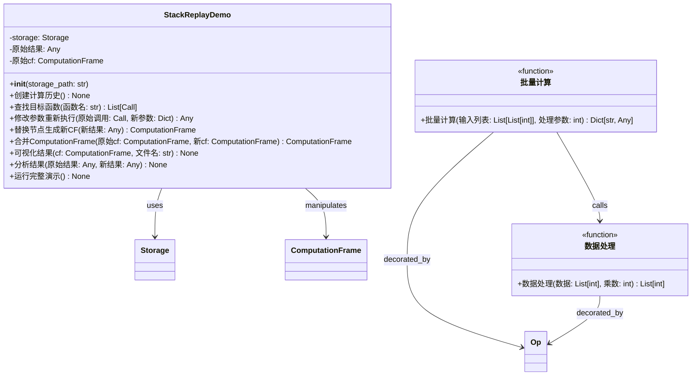
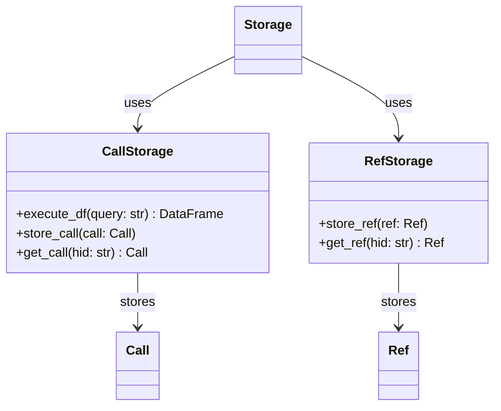

# Mandala框架核心类图

## 1. 核心存储和计算框架类图

```mermaid
classDiagram
    class Storage {
        -db_path: str
        -call_storage: CallStorage
        -ref_storage: RefStorage
        -cache: Dict
        +__init__(db_path: str)
        +attach(refs: List[Ref])
        +unwrap(obj: Any) Any
        +cf(result: Any) ComputationFrame
        +mget_call(hids: List[str]) List[Call]
        +drop_calls(calls_or_hids: Any, delete_dependents: bool)
        +cache_info()
        +clear_cache()
    }

    class ComputationFrame {
        -storage: Storage
        -inp: Dict[str, Dict[str, Set[str]]]
        -out: Dict[str, Dict[str, Set[str]]]
        -vs: Dict[str, Set[str]]
        -fs: Dict[str, Set[str]]
        -refinv: Dict[str, Set[str]]
        -callinv: Dict[str, Set[str]]
        -creator: Dict[str, str]
        -consumers: Dict[str, Set[str]]
        -refs: Dict[str, Ref]
        -calls: Dict[str, Call]
        +__init__(storage: Storage, ...)
        +vnames() Set[str]
        +fnames() Set[str]
        +nodes() Set[str]
        +edges() List[Tuple[str, str, str]]
        +expand_back(recursive: bool) ComputationFrame
        +expand_forward(recursive: bool) ComputationFrame
        +expand_all() ComputationFrame
        +drop_node(node: str) ComputationFrame
        +drop_var(vname: str) ComputationFrame
        +drop_func(fname: str) ComputationFrame
        +rename_var(vname: str, new_vname: str) ComputationFrame
        +merge_into(node_to_merge: str, merge_into: str) ComputationFrame
        +merge_vars() ComputationFrame
        +cleanup() ComputationFrame
        +df(*nodes: str) DataFrame
        +eval(*nodes: str) DataFrame
        +draw(path: str, orientation: str)
        +__or__(other: ComputationFrame) ComputationFrame
        +__and__(other: ComputationFrame) ComputationFrame
        +__sub__(other: ComputationFrame) ComputationFrame
    }

    class Ref {
        +hid: str
        +cid: str
        +__init__(hid: str, cid: str)
    }

    class Call {
        +hid: str
        +op: Op
        +inputs: Dict[str, Ref]
        +outputs: Dict[str, Ref]
        +__init__(hid: str, op: Op, inputs: Dict, outputs: Dict)
    }

    class Op {
        +name: str
        +func: Callable
        +output_names: List[str]
        +__init__(name: str, func: Callable, output_names: List[str])
        +__call__(*args, **kwargs) Any
    }

    Storage ||--o{ ComputationFrame : creates
    ComputationFrame ||--o{ Ref : contains
    ComputationFrame ||--o{ Call : contains
    Call ||--o{ Op : uses
    Call ||--o{ Ref : inputs/outputs
```

## 2. 栈回放系统类图



## 3. 工具函数和辅助类图

```mermaid
classDiagram
    class RefCollection {
        +refs: Tuple[Ref, ...]
        +__init__(refs: Tuple[Ref, ...])
        +hid: str
    }

    class CallCollection {
        +calls: Tuple[Call, ...]
        +__init__(calls: Tuple[Call, ...])
        +hid: str
    }

    class get_name_proj {
        <<function>>
        +get_name_proj(op: Op) Callable[[str], str]
    }

    class get_reverse_proj {
        <<function>>
        +get_reverse_proj(call: Call) Callable[[str], Set[str]]
    }

    RefCollection ||--o{ Ref : contains
    CallCollection ||--o{ Call : contains
    ComputationFrame --> RefCollection : creates
    ComputationFrame --> CallCollection : creates
    ComputationFrame --> get_name_proj : uses
    ComputationFrame --> get_reverse_proj : uses
```

## 4. 存储层类图

