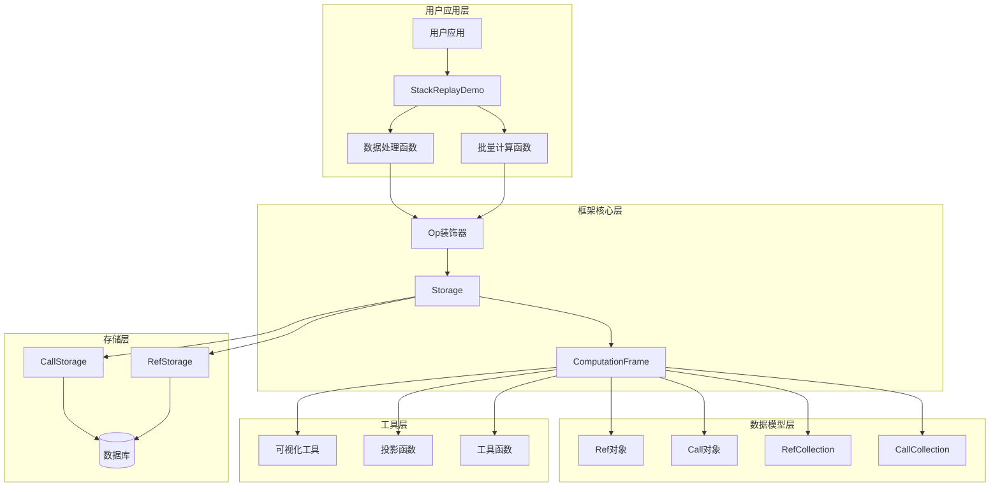
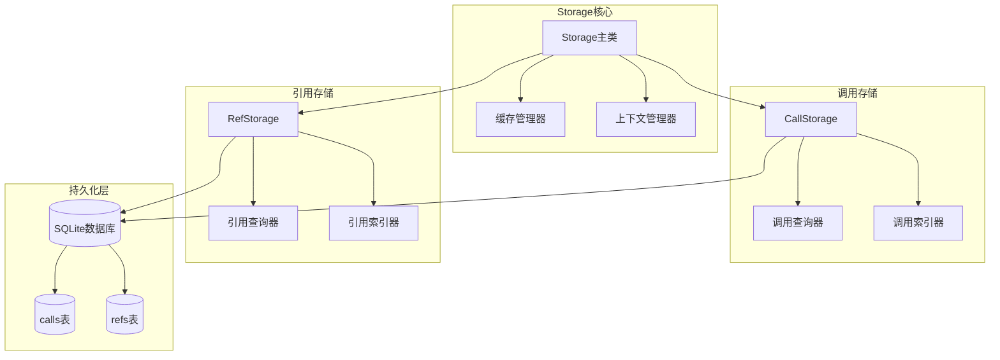
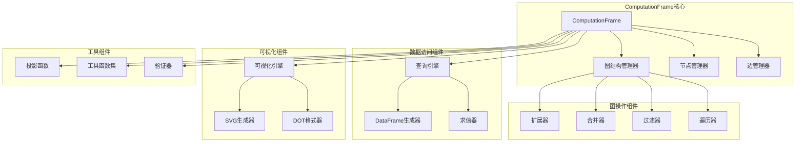
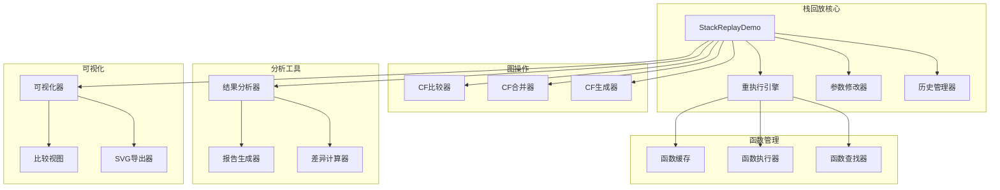
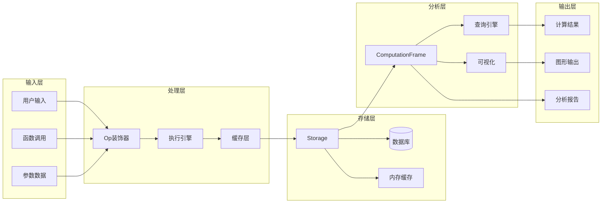
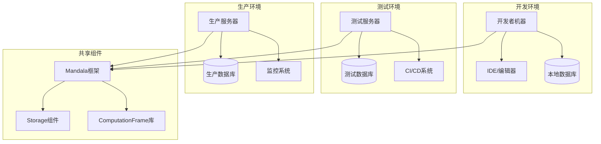

# Mandala框架组件图

## 1. 系统整体组件架构

```mermaid
graph TB
    subgraph "用户应用层"
        UA[用户应用]
        SRD[StackReplayDemo]
        DF[数据处理函数]
        BC[批量计算函数]
    end
    
    subgraph "框架核心层"
        OP[Op装饰器]
        ST[Storage]
        CF[ComputationFrame]
    end
    
    subgraph "存储层"
        CS[CallStorage]
        RS[RefStorage]
        DB[(数据库)]
    end
    
    subgraph "数据模型层"
        REF[Ref对象]
        CALL[Call对象]
        RC[RefCollection]
        CC[CallCollection]
    end
    
    subgraph "工具层"
        VIS[可视化工具]
        PROJ[投影函数]
        UTIL[工具函数]
    end
    
    UA --> SRD
    SRD --> DF
    SRD --> BC
    DF --> OP
    BC --> OP
    OP --> ST
    ST --> CF
    ST --> CS
    ST --> RS
    CS --> DB
    RS --> DB
    CF --> REF
    CF --> CALL
    CF --> RC
    CF --> CC
    CF --> VIS
    CF --> PROJ
    CF --> UTIL
```

## 2. 存储子系统组件图

```mermaid
graph TB
    subgraph "Storage核心"
        ST[Storage主类]
        CACHE[缓存管理器]
        CTX[上下文管理器]
    end
    
    subgraph "调用存储"
        CS[CallStorage]
        CQ[调用查询器]
        CI[调用索引器]
    end
    
    subgraph "引用存储"
        RS[RefStorage]
        RQ[引用查询器]
        RI[引用索引器]
    end
    
    subgraph "持久化层"
        DB[(SQLite数据库)]
        CALLS_TABLE[(calls表)]
        REFS_TABLE[(refs表)]
    end
    
    ST --> CACHE
    ST --> CTX
    ST --> CS
    ST --> RS
    CS --> CQ
    CS --> CI
    RS --> RQ
    RS --> RI
    CS --> DB
    RS --> DB
    DB --> CALLS_TABLE
    DB --> REFS_TABLE
```

## 3. ComputationFrame子系统组件图

```mermaid
graph TB
    subgraph "ComputationFrame核心"
        CF[ComputationFrame]
        GS[图结构管理器]
        NM[节点管理器]
        EM[边管理器]
    end
    
    subgraph "图操作组件"
        EXP[扩展器]
        MERGE[合并器]
        FILTER[过滤器]
        TRAV[遍历器]
    end
    
    subgraph "数据访问组件"
        QE[查询引擎]
        DF_GEN[DataFrame生成器]
        EVAL[求值器]
    end
    
    subgraph "可视化组件"
        VIS[可视化引擎]
        SVG[SVG生成器]
        DOT[DOT格式器]
    end
    
    subgraph "工具组件"
        PROJ[投影函数]
        UTIL[工具函数集]
        VALID[验证器]
    end
    
    CF --> GS
    CF --> NM
    CF --> EM
    GS --> EXP
    GS --> MERGE
    GS --> FILTER
    GS --> TRAV
    CF --> QE
    QE --> DF_GEN
    QE --> EVAL
    CF --> VIS
    VIS --> SVG
    VIS --> DOT
    CF --> PROJ
    CF --> UTIL
    CF --> VALID
```

## 4. 栈回放系统组件图

```mermaid
graph TB
    subgraph "栈回放核心"
        SRD[StackReplayDemo]
        HM[历史管理器]
        PM[参数修改器]
        RE[重执行引擎]
    end
    
    subgraph "函数管理"
        FF[函数查找器]
        FE[函数执行器]
        FC[函数缓存]
    end
    
    subgraph "图操作"
        CFG[CF生成器]
        CFM[CF合并器]
        CFC[CF比较器]
    end
    
    subgraph "分析工具"
        RA[结果分析器]
        DIFF[差异计算器]
        REP[报告生成器]
    end
    
    subgraph "可视化"
        VIS[可视化器]
        SVG[SVG导出器]
        COMP[比较视图]
    end
    
    SRD --> HM
    SRD --> PM
    SRD --> RE
    RE --> FF
    RE --> FE
    RE --> FC
    SRD --> CFG
    SRD --> CFM
    SRD --> CFC
    SRD --> RA
    RA --> DIFF
    RA --> REP
    SRD --> VIS
    VIS --> SVG
    VIS --> COMP
```

## 5. 数据流组件图

```mermaid
graph LR
    subgraph "输入层"
        UI[用户输入]
        FUNC[函数调用]
        PARAM[参数数据]
    end
    
    subgraph "处理层"
        OP[Op装饰器]
        EXEC[执行引擎]
        CACHE[缓存层]
    end
    
    subgraph "存储层"
        ST[Storage]
        DB[(数据库)]
        MEM[内存缓存]
    end
    
    subgraph "分析层"
        CF[ComputationFrame]
        QUERY[查询引擎]
        VIS[可视化]
    end
    
    subgraph "输出层"
        RESULT[计算结果]
        GRAPH[图形输出]
        REPORT[分析报告]
    end
    
    UI --> OP
    FUNC --> OP
    PARAM --> OP
    OP --> EXEC
    EXEC --> CACHE
    CACHE --> ST
    ST --> DB
    ST --> MEM
    ST --> CF
    CF --> QUERY
    CF --> VIS
    QUERY --> RESULT
    VIS --> GRAPH
    CF --> REPORT
```

## 6. 部署组件图

```mermaid
graph TB
    subgraph "开发环境"
        DEV[开发者机器]
        IDE[IDE/编辑器]
        LOCAL_DB[(本地数据库)]
    end
    
    subgraph "测试环境"
        TEST[测试服务器]
        TEST_DB[(测试数据库)]
        CI[CI/CD系统]
    end
    
    subgraph "生产环境"
        PROD[生产服务器]
        PROD_DB[(生产数据库)]
        MONITOR[监控系统]
    end
    
    subgraph "共享组件"
        MANDALA[Mandala框架]
        STORAGE[Storage组件]
        CF_LIB[ComputationFrame库]
    end
    
    DEV --> IDE
    DEV --> LOCAL_DB
    DEV --> MANDALA
    
    TEST --> TEST_DB
    TEST --> CI
    TEST --> MANDALA
    
    PROD --> PROD_DB
    PROD --> MONITOR
    PROD --> MANDALA
    
    MANDALA --> STORAGE
    MANDALA --> CF_LIB
```