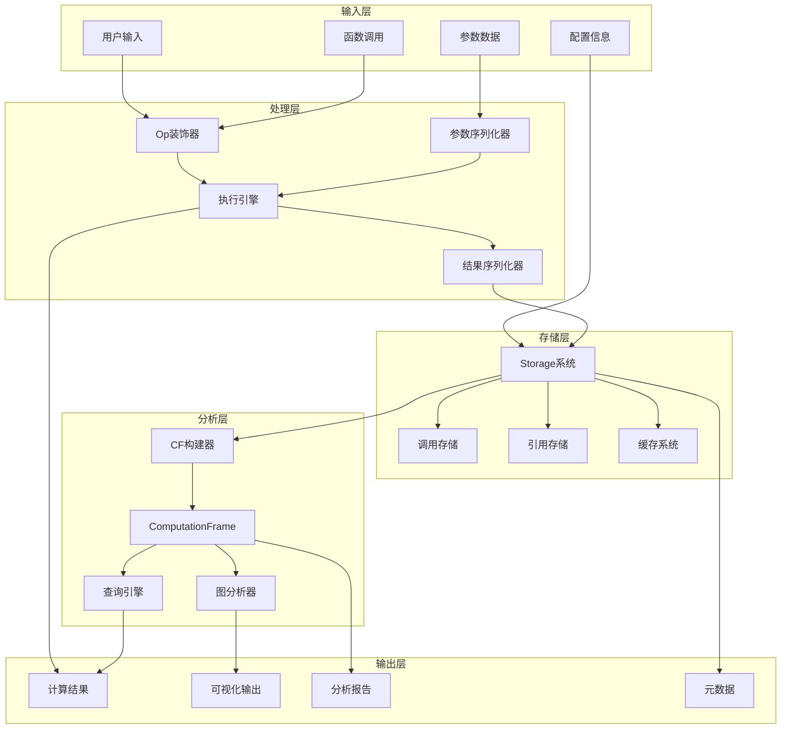
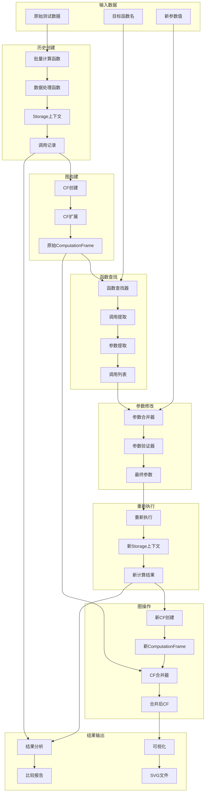
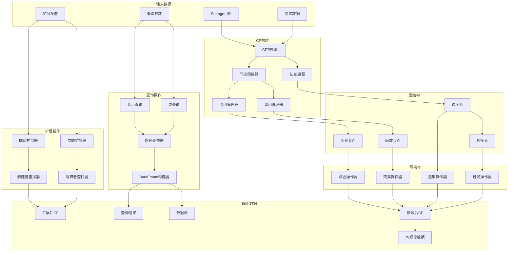
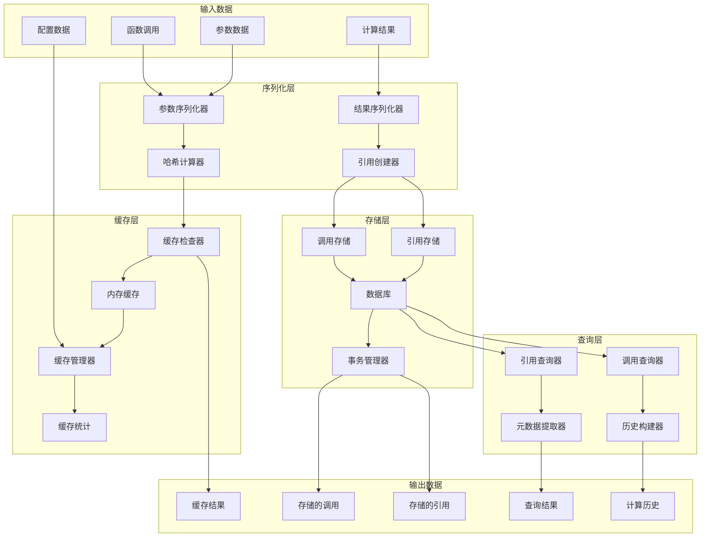
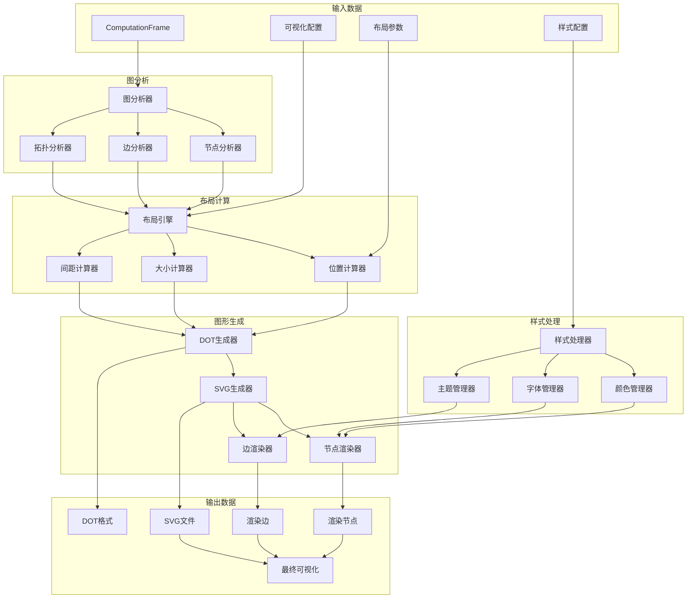
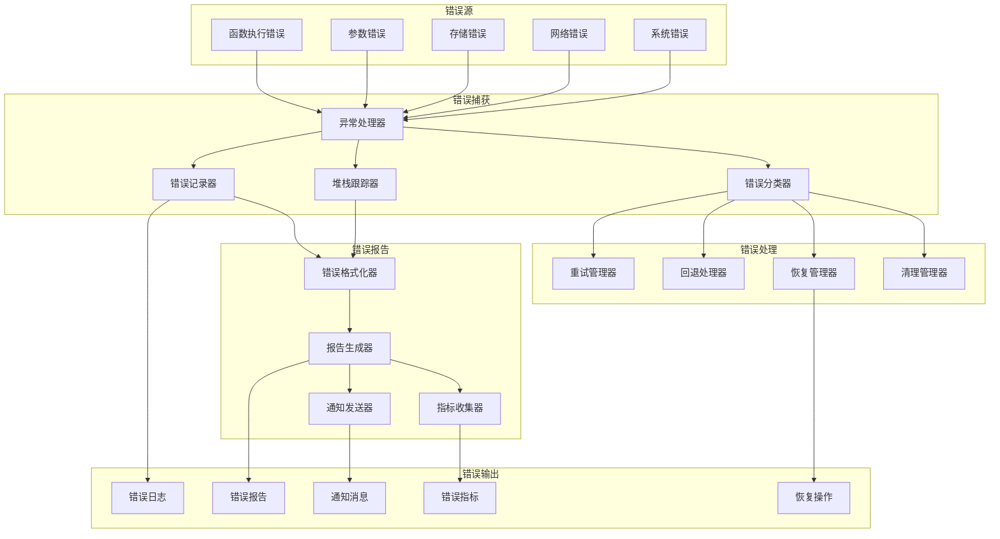

# Mandala框架数据流图

## 1. 系统整体数据流图

```mermaid
flowchart TD
    subgraph "输入层"
        USER_INPUT[用户输入]
        FUNC_CALL[函数调用]
        PARAMS[参数数据]
        CONFIG[配置信息]
    end
    
    subgraph "处理层"
        OP_DECORATOR[Op装饰器]
        EXECUTION_ENGINE[执行引擎]
        PARAM_SERIALIZER[参数序列化器]
        RESULT_SERIALIZER[结果序列化器]
    end
    
    subgraph "存储层"
        STORAGE[Storage系统]
        CALL_STORAGE[调用存储]
        REF_STORAGE[引用存储]
        CACHE[缓存系统]
    end
    
    subgraph "分析层"
        CF_BUILDER[CF构建器]
        COMPUTATION_FRAME[ComputationFrame]
        QUERY_ENGINE[查询引擎]
        GRAPH_ANALYZER[图分析器]
    end
    
    subgraph "输出层"
        RESULTS[计算结果]
        VISUALIZATIONS[可视化输出]
        REPORTS[分析报告]
        METADATA[元数据]
    end
    
    USER_INPUT --> OP_DECORATOR
    FUNC_CALL --> OP_DECORATOR
    PARAMS --> PARAM_SERIALIZER
    CONFIG --> STORAGE
    
    OP_DECORATOR --> EXECUTION_ENGINE
    PARAM_SERIALIZER --> EXECUTION_ENGINE
    EXECUTION_ENGINE --> RESULT_SERIALIZER
    
    RESULT_SERIALIZER --> STORAGE
    STORAGE --> CALL_STORAGE
    STORAGE --> REF_STORAGE
    STORAGE --> CACHE
    
    STORAGE --> CF_BUILDER
    CF_BUILDER --> COMPUTATION_FRAME
    COMPUTATION_FRAME --> QUERY_ENGINE
    COMPUTATION_FRAME --> GRAPH_ANALYZER
    
    EXECUTION_ENGINE --> RESULTS
    QUERY_ENGINE --> RESULTS
    GRAPH_ANALYZER --> VISUALIZATIONS
    COMPUTATION_FRAME --> REPORTS
    STORAGE --> METADATA
```

## 2. 栈回放数据流图

```mermaid
flowchart TD
    subgraph "输入数据"
        ORIGINAL_DATA[原始测试数据]
        TARGET_FUNC[目标函数名]
        NEW_PARAMS[新参数值]
    end
    
    subgraph "历史创建"
        BATCH_CALC[批量计算函数]
        DATA_PROCESS[数据处理函数]
        STORAGE_CONTEXT[Storage上下文]
        CALL_RECORDS[调用记录]
    end
    
    subgraph "图构建"
        CF_CREATION[CF创建]
        CF_EXPANSION[CF扩展]
        ORIGINAL_CF[原始ComputationFrame]
    end
    
    subgraph "函数查找"
        FUNC_FINDER[函数查找器]
        CALL_EXTRACTION[调用提取]
        PARAM_EXTRACTION[参数提取]
        CALL_LIST[调用列表]
    end
    
    subgraph "参数修改"
        PARAM_MERGER[参数合并器]
        PARAM_VALIDATOR[参数验证器]
        FINAL_PARAMS[最终参数]
    end
    
    subgraph "重新执行"
        RE_EXECUTION[重新执行]
        NEW_STORAGE_CONTEXT[新Storage上下文]
        NEW_RESULTS[新计算结果]
    end
    
    subgraph "图操作"
        NEW_CF_CREATION[新CF创建]
        NEW_CF[新ComputationFrame]
        CF_MERGER[CF合并器]
        MERGED_CF[合并后CF]
    end
    
    subgraph "结果输出"
        VISUALIZATION[可视化]
        SVG_FILES[SVG文件]
        ANALYSIS[结果分析]
        COMPARISON_REPORT[比较报告]
    end
    
    ORIGINAL_DATA --> BATCH_CALC
    BATCH_CALC --> DATA_PROCESS
    DATA_PROCESS --> STORAGE_CONTEXT
    STORAGE_CONTEXT --> CALL_RECORDS
    
    CALL_RECORDS --> CF_CREATION
    CF_CREATION --> CF_EXPANSION
    CF_EXPANSION --> ORIGINAL_CF
    
    ORIGINAL_CF --> FUNC_FINDER
    TARGET_FUNC --> FUNC_FINDER
    FUNC_FINDER --> CALL_EXTRACTION
    CALL_EXTRACTION --> PARAM_EXTRACTION
    PARAM_EXTRACTION --> CALL_LIST
    
    CALL_LIST --> PARAM_MERGER
    NEW_PARAMS --> PARAM_MERGER
    PARAM_MERGER --> PARAM_VALIDATOR
    PARAM_VALIDATOR --> FINAL_PARAMS
    
    FINAL_PARAMS --> RE_EXECUTION
    RE_EXECUTION --> NEW_STORAGE_CONTEXT
    NEW_STORAGE_CONTEXT --> NEW_RESULTS
    
    NEW_RESULTS --> NEW_CF_CREATION
    NEW_CF_CREATION --> NEW_CF
    NEW_CF --> CF_MERGER
    ORIGINAL_CF --> CF_MERGER
    CF_MERGER --> MERGED_CF
    
    MERGED_CF --> VISUALIZATION
    VISUALIZATION --> SVG_FILES
    NEW_RESULTS --> ANALYSIS
    CALL_RECORDS --> ANALYSIS
    ANALYSIS --> COMPARISON_REPORT
```

## 3. ComputationFrame数据流图

```mermaid
flowchart TD
    subgraph "输入数据"
        STORAGE_REF[Storage引用]
        RESULT_DATA[结果数据]
        EXPANSION_CONFIG[扩展配置]
        QUERY_PARAMS[查询参数]
    end
    
    subgraph "CF构建"
        CF_INIT[CF初始化]
        NODE_CREATOR[节点创建器]
        EDGE_CREATOR[边创建器]
        REF_MANAGER[引用管理器]
        CALL_MANAGER[调用管理器]
    end
    
    subgraph "图结构"
        VARIABLE_NODES[变量节点]
        FUNCTION_NODES[函数节点]
        EDGES[边关系]
        ADJACENCY_LISTS[邻接表]
    end
    
    subgraph "扩展操作"
        BACK_EXPANDER[向后扩展器]
        FORWARD_EXPANDER[向前扩展器]
        CREATOR_FINDER[创建者查找器]
        CONSUMER_FINDER[消费者查找器]
    end
    
    subgraph "查询操作"
        NODE_QUERY[节点查询]
        EDGE_QUERY[边查询]
        PATH_FINDER[路径查找器]
        DATAFRAME_BUILDER[DataFrame构建器]
    end
    
    subgraph "图操作"
        UNION_OPERATOR[联合操作器]
        INTERSECTION_OPERATOR[交集操作器]
        DIFFERENCE_OPERATOR[差集操作器]
        FILTER_OPERATOR[过滤操作器]
    end
    
    subgraph "输出数据"
        EXPANDED_CF[扩展后CF]
        QUERY_RESULTS[查询结果]
        DATAFRAMES[数据框]
        MODIFIED_CF[修改后CF]
        VISUALIZATION_DATA[可视化数据]
    end
    
    STORAGE_REF --> CF_INIT
    RESULT_DATA --> CF_INIT
    CF_INIT --> NODE_CREATOR
    CF_INIT --> EDGE_CREATOR
    NODE_CREATOR --> REF_MANAGER
    NODE_CREATOR --> CALL_MANAGER
    
    REF_MANAGER --> VARIABLE_NODES
    CALL_MANAGER --> FUNCTION_NODES
    EDGE_CREATOR --> EDGES
    EDGES --> ADJACENCY_LISTS
    
    EXPANSION_CONFIG --> BACK_EXPANDER
    EXPANSION_CONFIG --> FORWARD_EXPANDER
    BACK_EXPANDER --> CREATOR_FINDER
    FORWARD_EXPANDER --> CONSUMER_FINDER
    CREATOR_FINDER --> EXPANDED_CF
    CONSUMER_FINDER --> EXPANDED_CF
    
    QUERY_PARAMS --> NODE_QUERY
    QUERY_PARAMS --> EDGE_QUERY
    NODE_QUERY --> PATH_FINDER
    EDGE_QUERY --> PATH_FINDER
    PATH_FINDER --> DATAFRAME_BUILDER
    DATAFRAME_BUILDER --> QUERY_RESULTS
    DATAFRAME_BUILDER --> DATAFRAMES
    
    VARIABLE_NODES --> UNION_OPERATOR
    FUNCTION_NODES --> INTERSECTION_OPERATOR
    EDGES --> DIFFERENCE_OPERATOR
    ADJACENCY_LISTS --> FILTER_OPERATOR
    UNION_OPERATOR --> MODIFIED_CF
    INTERSECTION_OPERATOR --> MODIFIED_CF
    DIFFERENCE_OPERATOR --> MODIFIED_CF
    FILTER_OPERATOR --> MODIFIED_CF
    
    MODIFIED_CF --> VISUALIZATION_DATA
```

## 4. Storage系统数据流图

```mermaid
flowchart TD
    subgraph "输入数据"
        FUNCTION_CALLS[函数调用]
        PARAMETERS[参数数据]
        RESULTS[计算结果]
        CONFIG_DATA[配置数据]
    end
    
    subgraph "序列化层"
        PARAM_SERIALIZER[参数序列化器]
        RESULT_SERIALIZER[结果序列化器]
        HASH_CALCULATOR[哈希计算器]
        REF_CREATOR[引用创建器]
    end
    
    subgraph "缓存层"
        CACHE_CHECKER[缓存检查器]
        CACHE_MANAGER[缓存管理器]
        MEMORY_CACHE[内存缓存]
        CACHE_STATS[缓存统计]
    end
    
    subgraph "存储层"
        CALL_STORAGE[调用存储]
        REF_STORAGE[引用存储]
        DATABASE[数据库]
        TRANSACTION_MANAGER[事务管理器]
    end
    
    subgraph "查询层"
        CALL_QUERY[调用查询器]
        REF_QUERY[引用查询器]
        HISTORY_BUILDER[历史构建器]
        METADATA_EXTRACTOR[元数据提取器]
    end
    
    subgraph "输出数据"
        CACHED_RESULTS[缓存结果]
        STORED_CALLS[存储的调用]
        STORED_REFS[存储的引用]
        QUERY_RESULTS[查询结果]
        COMPUTATION_HISTORY[计算历史]
    end
    
    FUNCTION_CALLS --> PARAM_SERIALIZER
    PARAMETERS --> PARAM_SERIALIZER
    RESULTS --> RESULT_SERIALIZER
    CONFIG_DATA --> CACHE_MANAGER
    
    PARAM_SERIALIZER --> HASH_CALCULATOR
    RESULT_SERIALIZER --> REF_CREATOR
    HASH_CALCULATOR --> CACHE_CHECKER
    REF_CREATOR --> REF_STORAGE
    
    CACHE_CHECKER --> MEMORY_CACHE
    MEMORY_CACHE --> CACHE_MANAGER
    CACHE_MANAGER --> CACHE_STATS
    CACHE_CHECKER --> CACHED_RESULTS
    
    REF_CREATOR --> CALL_STORAGE
    CALL_STORAGE --> DATABASE
    REF_STORAGE --> DATABASE
    DATABASE --> TRANSACTION_MANAGER
    TRANSACTION_MANAGER --> STORED_CALLS
    TRANSACTION_MANAGER --> STORED_REFS
    
    DATABASE --> CALL_QUERY
    DATABASE --> REF_QUERY
    CALL_QUERY --> HISTORY_BUILDER
    REF_QUERY --> METADATA_EXTRACTOR
    HISTORY_BUILDER --> COMPUTATION_HISTORY
    METADATA_EXTRACTOR --> QUERY_RESULTS
```

## 5. 可视化数据流图

```mermaid
flowchart TD
    subgraph "输入数据"
        COMPUTATION_FRAME[ComputationFrame]
        VIS_CONFIG[可视化配置]
        LAYOUT_PARAMS[布局参数]
        STYLE_CONFIG[样式配置]
    end
    
    subgraph "图分析"
        GRAPH_ANALYZER[图分析器]
        NODE_ANALYZER[节点分析器]
        EDGE_ANALYZER[边分析器]
        TOPOLOGY_ANALYZER[拓扑分析器]
    end
    
    subgraph "布局计算"
        LAYOUT_ENGINE[布局引擎]
        POSITION_CALCULATOR[位置计算器]
        SIZE_CALCULATOR[大小计算器]
        SPACING_CALCULATOR[间距计算器]
    end
    
    subgraph "图形生成"
        DOT_GENERATOR[DOT生成器]
        SVG_GENERATOR[SVG生成器]
        NODE_RENDERER[节点渲染器]
        EDGE_RENDERER[边渲染器]
    end
    
    subgraph "样式处理"
        STYLE_PROCESSOR[样式处理器]
        COLOR_MANAGER[颜色管理器]
        FONT_MANAGER[字体管理器]
        THEME_MANAGER[主题管理器]
    end
    
    subgraph "输出数据"
        DOT_FORMAT[DOT格式]
        SVG_FILES[SVG文件]
        RENDERED_NODES[渲染节点]
        RENDERED_EDGES[渲染边]
        FINAL_VISUALIZATION[最终可视化]
    end
    
    COMPUTATION_FRAME --> GRAPH_ANALYZER
    VIS_CONFIG --> LAYOUT_ENGINE
    LAYOUT_PARAMS --> POSITION_CALCULATOR
    STYLE_CONFIG --> STYLE_PROCESSOR
    
    GRAPH_ANALYZER --> NODE_ANALYZER
    GRAPH_ANALYZER --> EDGE_ANALYZER
    GRAPH_ANALYZER --> TOPOLOGY_ANALYZER
    
    NODE_ANALYZER --> LAYOUT_ENGINE
    EDGE_ANALYZER --> LAYOUT_ENGINE
    TOPOLOGY_ANALYZER --> LAYOUT_ENGINE
    
    LAYOUT_ENGINE --> POSITION_CALCULATOR
    LAYOUT_ENGINE --> SIZE_CALCULATOR
    LAYOUT_ENGINE --> SPACING_CALCULATOR
    
    POSITION_CALCULATOR --> DOT_GENERATOR
    SIZE_CALCULATOR --> DOT_GENERATOR
    SPACING_CALCULATOR --> DOT_GENERATOR
    
    DOT_GENERATOR --> SVG_GENERATOR
    SVG_GENERATOR --> NODE_RENDERER
    SVG_GENERATOR --> EDGE_RENDERER
    
    STYLE_PROCESSOR --> COLOR_MANAGER
    STYLE_PROCESSOR --> FONT_MANAGER
    STYLE_PROCESSOR --> THEME_MANAGER
    
    COLOR_MANAGER --> NODE_RENDERER
    FONT_MANAGER --> NODE_RENDERER
    THEME_MANAGER --> EDGE_RENDERER
    
    DOT_GENERATOR --> DOT_FORMAT
    NODE_RENDERER --> RENDERED_NODES
    EDGE_RENDERER --> RENDERED_EDGES
    SVG_GENERATOR --> SVG_FILES
    
    RENDERED_NODES --> FINAL_VISUALIZATION
    RENDERED_EDGES --> FINAL_VISUALIZATION
    SVG_FILES --> FINAL_VISUALIZATION
```

## 6. 错误处理数据流图

```mermaid
flowchart TD
    subgraph "错误源"
        FUNC_ERROR[函数执行错误]
        PARAM_ERROR[参数错误]
        STORAGE_ERROR[存储错误]
        NETWORK_ERROR[网络错误]
        SYSTEM_ERROR[系统错误]
    end
    
    subgraph "错误捕获"
        EXCEPTION_HANDLER[异常处理器]
        ERROR_CLASSIFIER[错误分类器]
        ERROR_LOGGER[错误记录器]
        STACK_TRACER[堆栈跟踪器]
    end
    
    subgraph "错误处理"
        RETRY_MANAGER[重试管理器]
        FALLBACK_HANDLER[回退处理器]
        RECOVERY_MANAGER[恢复管理器]
        CLEANUP_MANAGER[清理管理器]
    end
    
    subgraph "错误报告"
        ERROR_FORMATTER[错误格式化器]
        REPORT_GENERATOR[报告生成器]
        NOTIFICATION_SENDER[通知发送器]
        METRICS_COLLECTOR[指标收集器]
    end
    
    subgraph "错误输出"
        ERROR_LOGS[错误日志]
        ERROR_REPORTS[错误报告]
        NOTIFICATIONS[通知消息]
        METRICS[错误指标]
        RECOVERY_ACTIONS[恢复操作]
    end
    
    FUNC_ERROR --> EXCEPTION_HANDLER
    PARAM_ERROR --> EXCEPTION_HANDLER
    STORAGE_ERROR --> EXCEPTION_HANDLER
    NETWORK_ERROR --> EXCEPTION_HANDLER
    SYSTEM_ERROR --> EXCEPTION_HANDLER
    
    EXCEPTION_HANDLER --> ERROR_CLASSIFIER
    EXCEPTION_HANDLER --> ERROR_LOGGER
    EXCEPTION_HANDLER --> STACK_TRACER
    
    ERROR_CLASSIFIER --> RETRY_MANAGER
    ERROR_CLASSIFIER --> FALLBACK_HANDLER
    ERROR_CLASSIFIER --> RECOVERY_MANAGER
    ERROR_CLASSIFIER --> CLEANUP_MANAGER
    
    ERROR_LOGGER --> ERROR_FORMATTER
    STACK_TRACER --> ERROR_FORMATTER
    ERROR_FORMATTER --> REPORT_GENERATOR
    REPORT_GENERATOR --> NOTIFICATION_SENDER
    REPORT_GENERATOR --> METRICS_COLLECTOR
    
    ERROR_LOGGER --> ERROR_LOGS
    REPORT_GENERATOR --> ERROR_REPORTS
    NOTIFICATION_SENDER --> NOTIFICATIONS
    METRICS_COLLECTOR --> METRICS
    RECOVERY_MANAGER --> RECOVERY_ACTIONS
```