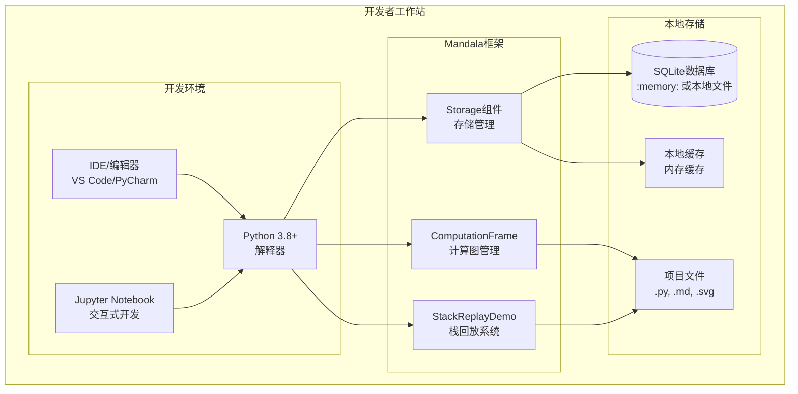
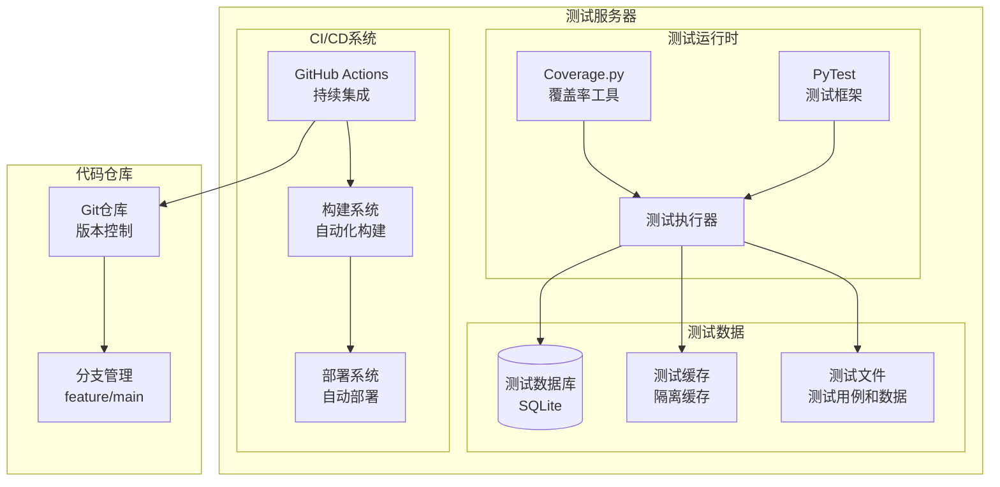
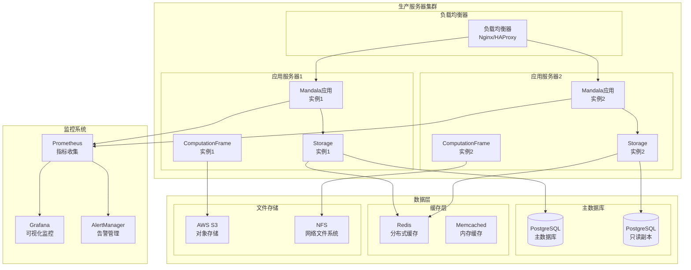
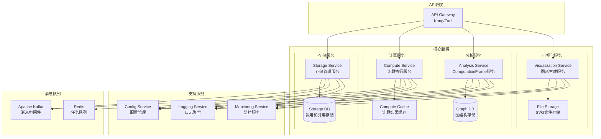
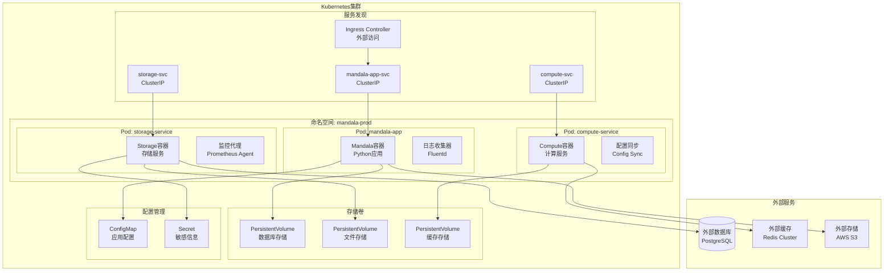
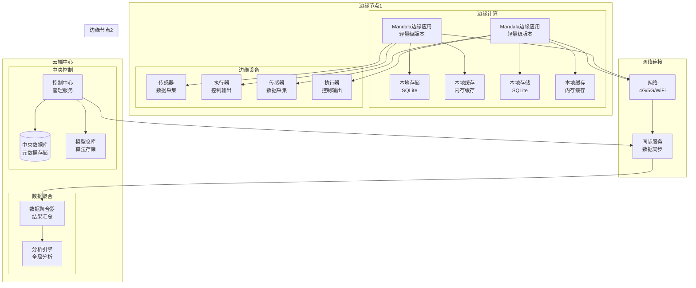

# Mandala框架部署图

## 1. 开发环境部署图

```mermaid
graph TB
    subgraph "开发者工作站"
        subgraph "开发环境"
            IDE[IDE/编辑器<br/>VS Code/PyCharm]
            PYTHON[Python 3.8+<br/>解释器]
            JUPYTER[Jupyter Notebook<br/>交互式开发]
        end
        
        subgraph "本地存储"
            LOCAL_DB[(SQLite数据库<br/>:memory: 或本地文件)]
            CACHE[本地缓存<br/>内存缓存]
            FILES[项目文件<br/>.py, .md, .svg]
        end
        
        subgraph "Mandala框架"
            STORAGE[Storage组件<br/>存储管理]
            CF[ComputationFrame<br/>计算图管理]
            STACK_REPLAY[StackReplayDemo<br/>栈回放系统]
        end
    end
    
    IDE --> PYTHON
    JUPYTER --> PYTHON
    PYTHON --> STORAGE
    PYTHON --> CF
    PYTHON --> STACK_REPLAY
    STORAGE --> LOCAL_DB
    STORAGE --> CACHE
    CF --> FILES
    STACK_REPLAY --> FILES
```

## 2. 测试环境部署图

```mermaid
graph TB
    subgraph "测试服务器"
        subgraph "测试运行时"
            PYTEST[PyTest<br/>测试框架]
            COVERAGE[Coverage.py<br/>覆盖率工具]
            TESTER[测试执行器]
        end
        
        subgraph "测试数据"
            TEST_DB[(测试数据库<br/>SQLite)]
            TEST_CACHE[测试缓存<br/>隔离缓存]
            TEST_FILES[测试文件<br/>测试用例和数据]
        end
        
        subgraph "CI/CD系统"
            GITHUB_ACTIONS[GitHub Actions<br/>持续集成]
            BUILD[构建系统<br/>自动化构建]
            DEPLOY[部署系统<br/>自动部署]
        end
    end
    
    subgraph "代码仓库"
        GIT[Git仓库<br/>版本控制]
        BRANCH[分支管理<br/>feature/main]
    end
    
    PYTEST --> TESTER
    COVERAGE --> TESTER
    TESTER --> TEST_DB
    TESTER --> TEST_CACHE
    TESTER --> TEST_FILES
    
    GITHUB_ACTIONS --> BUILD
    BUILD --> DEPLOY
    GITHUB_ACTIONS --> GIT
    GIT --> BRANCH
```

## 3. 生产环境部署图

```mermaid
graph TB
    subgraph "生产服务器集群"
        subgraph "应用服务器1"
            APP1[Mandala应用<br/>实例1]
            STORAGE1[Storage<br/>实例1]
            CF1[ComputationFrame<br/>实例1]
        end
        
        subgraph "应用服务器2"
            APP2[Mandala应用<br/>实例2]
            STORAGE2[Storage<br/>实例2]
            CF2[ComputationFrame<br/>实例2]
        end
        
        subgraph "负载均衡器"
            LB[负载均衡器<br/>Nginx/HAProxy]
        end
    end
    
    subgraph "数据层"
        subgraph "主数据库"
            MAIN_DB[(PostgreSQL<br/>主数据库)]
            REPLICA_DB[(PostgreSQL<br/>只读副本)]
        end
        
        subgraph "缓存层"
            REDIS[Redis<br/>分布式缓存]
            MEMCACHED[Memcached<br/>内存缓存]
        end
        
        subgraph "文件存储"
            S3[AWS S3<br/>对象存储]
            NFS[NFS<br/>网络文件系统]
        end
    end
    
    subgraph "监控系统"
        PROMETHEUS[Prometheus<br/>指标收集]
        GRAFANA[Grafana<br/>可视化监控]
        ALERTMANAGER[AlertManager<br/>告警管理]
    end
    
    LB --> APP1
    LB --> APP2
    APP1 --> STORAGE1
    APP2 --> STORAGE2
    STORAGE1 --> MAIN_DB
    STORAGE2 --> REPLICA_DB
    STORAGE1 --> REDIS
    STORAGE2 --> REDIS
    CF1 --> S3
    CF2 --> NFS
    
    APP1 --> PROMETHEUS
    APP2 --> PROMETHEUS
    PROMETHEUS --> GRAFANA
    PROMETHEUS --> ALERTMANAGER
```

## 4. 微服务架构部署图

```mermaid
graph TB
    subgraph "API网关"
        GATEWAY[API Gateway<br/>Kong/Zuul]
    end
    
    subgraph "核心服务"
        subgraph "存储服务"
            STORAGE_SVC[Storage Service<br/>存储管理服务]
            STORAGE_DB[(Storage DB<br/>调用和引用存储)]
        end
        
        subgraph "计算服务"
            COMPUTE_SVC[Compute Service<br/>计算执行服务]
            COMPUTE_CACHE[Compute Cache<br/>计算结果缓存]
        end
        
        subgraph "分析服务"
            ANALYSIS_SVC[Analysis Service<br/>ComputationFrame服务]
            GRAPH_DB[(Graph DB<br/>图结构存储)]
        end
        
        subgraph "可视化服务"
            VIS_SVC[Visualization Service<br/>图形生成服务]
            FILE_STORAGE[File Storage<br/>SVG文件存储]
        end
    end
    
    subgraph "支持服务"
        CONFIG_SVC[Config Service<br/>配置管理]
        LOG_SVC[Logging Service<br/>日志聚合]
        MONITOR_SVC[Monitoring Service<br/>监控服务]
    end
    
    subgraph "消息队列"
        KAFKA[Apache Kafka<br/>消息中间件]
        REDIS_QUEUE[Redis<br/>任务队列]
    end
    
    GATEWAY --> STORAGE_SVC
    GATEWAY --> COMPUTE_SVC
    GATEWAY --> ANALYSIS_SVC
    GATEWAY --> VIS_SVC
    
    STORAGE_SVC --> STORAGE_DB
    COMPUTE_SVC --> COMPUTE_CACHE
    ANALYSIS_SVC --> GRAPH_DB
    VIS_SVC --> FILE_STORAGE
    
    STORAGE_SVC --> KAFKA
    COMPUTE_SVC --> KAFKA
    ANALYSIS_SVC --> REDIS_QUEUE
    
    STORAGE_SVC --> CONFIG_SVC
    COMPUTE_SVC --> CONFIG_SVC
    ANALYSIS_SVC --> CONFIG_SVC
    VIS_SVC --> CONFIG_SVC
    
    STORAGE_SVC --> LOG_SVC
    COMPUTE_SVC --> LOG_SVC
    ANALYSIS_SVC --> LOG_SVC
    VIS_SVC --> LOG_SVC
    
    STORAGE_SVC --> MONITOR_SVC
    COMPUTE_SVC --> MONITOR_SVC
    ANALYSIS_SVC --> MONITOR_SVC
    VIS_SVC --> MONITOR_SVC
```

## 5. 容器化部署图

```mermaid
graph TB
    subgraph "Kubernetes集群"
        subgraph "命名空间: mandala-prod"
            subgraph "Pod: mandala-app"
                CONTAINER1[Mandala容器<br/>Python应用]
                SIDECAR1[日志收集器<br/>Fluentd]
            end
            
            subgraph "Pod: storage-service"
                CONTAINER2[Storage容器<br/>存储服务]
                SIDECAR2[监控代理<br/>Prometheus Agent]
            end
            
            subgraph "Pod: compute-service"
                CONTAINER3[Compute容器<br/>计算服务]
                SIDECAR3[配置同步<br/>Config Sync]
            end
        end
        
        subgraph "服务发现"
            SERVICE1[mandala-app-svc<br/>ClusterIP]
            SERVICE2[storage-svc<br/>ClusterIP]
            SERVICE3[compute-svc<br/>ClusterIP]
            INGRESS[Ingress Controller<br/>外部访问]
        end
        
        subgraph "存储卷"
            PV1[PersistentVolume<br/>数据库存储]
            PV2[PersistentVolume<br/>文件存储]
            PV3[PersistentVolume<br/>缓存存储]
        end
        
        subgraph "配置管理"
            CONFIGMAP[ConfigMap<br/>应用配置]
            SECRET[Secret<br/>敏感信息]
        end
    end
    
    subgraph "外部服务"
        EXTERNAL_DB[(外部数据库<br/>PostgreSQL)]
        EXTERNAL_CACHE[外部缓存<br/>Redis Cluster]
        EXTERNAL_STORAGE[外部存储<br/>AWS S3]
    end
    
    INGRESS --> SERVICE1
    SERVICE1 --> CONTAINER1
    SERVICE2 --> CONTAINER2
    SERVICE3 --> CONTAINER3
    
    CONTAINER1 --> PV1
    CONTAINER2 --> PV2
    CONTAINER3 --> PV3
    
    CONTAINER1 --> CONFIGMAP
    CONTAINER2 --> SECRET
    
    CONTAINER2 --> EXTERNAL_DB
    CONTAINER3 --> EXTERNAL_CACHE
    CONTAINER1 --> EXTERNAL_STORAGE
```

## 6. 边缘计算部署图

```mermaid
graph TB
    subgraph "云端中心"
        subgraph "中央控制"
            CONTROL[控制中心<br/>管理服务]
            CENTRAL_DB[(中央数据库<br/>元数据存储)]
            MODEL_REPO[模型仓库<br/>算法存储]
        end
        
        subgraph "数据聚合"
            AGGREGATOR[数据聚合器<br/>结果汇总]
            ANALYTICS[分析引擎<br/>全局分析]
        end
    end
    
    subgraph "边缘节点1"
        subgraph "边缘计算"
            EDGE_APP1[Mandala边缘应用<br/>轻量级版本]
            EDGE_STORAGE1[本地存储<br/>SQLite]
            EDGE_CACHE1[本地缓存<br/>内存缓存]
        end
        
        subgraph "边缘设备"
            SENSOR1[传感器<br/>数据采集]
            ACTUATOR1[执行器<br/>控制输出]
        end
    end
    
    subgraph "边缘节点2"
        subgraph "边缘计算"
            EDGE_APP2[Mandala边缘应用<br/>轻量级版本]
            EDGE_STORAGE2[本地存储<br/>SQLite]
            EDGE_CACHE2[本地缓存<br/>内存缓存]
        end
        
        subgraph "边缘设备"
            SENSOR2[传感器<br/>数据采集]
            ACTUATOR2[执行器<br/>控制输出]
        end
    end
    
    subgraph "网络连接"
        NETWORK[网络<br/>4G/5G/WiFi]
        SYNC[同步服务<br/>数据同步]
    end
    
    CONTROL --> CENTRAL_DB
    CONTROL --> MODEL_REPO
    AGGREGATOR --> ANALYTICS
    
    EDGE_APP1 --> EDGE_STORAGE1
    EDGE_APP1 --> EDGE_CACHE1
    EDGE_APP1 --> SENSOR1
    EDGE_APP1 --> ACTUATOR1
    
    EDGE_APP2 --> EDGE_STORAGE2
    EDGE_APP2 --> EDGE_CACHE2
    EDGE_APP2 --> SENSOR2
    EDGE_APP2 --> ACTUATOR2
    
    EDGE_APP1 --> NETWORK
    EDGE_APP2 --> NETWORK
    NETWORK --> SYNC
    SYNC --> AGGREGATOR
    CONTROL --> SYNC
```