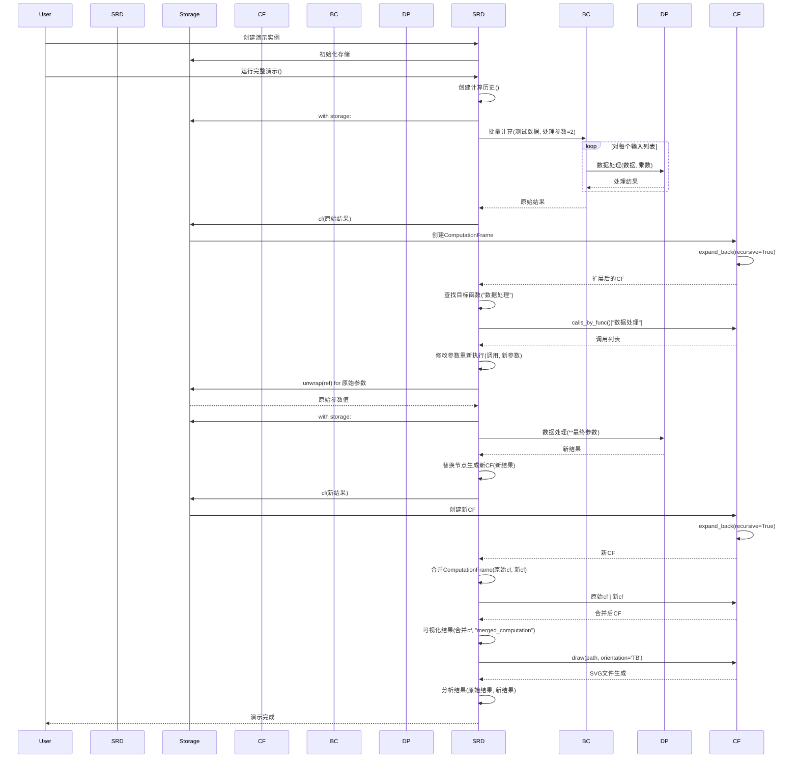
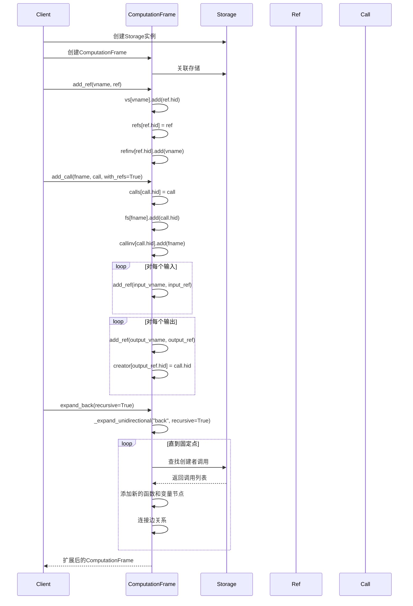
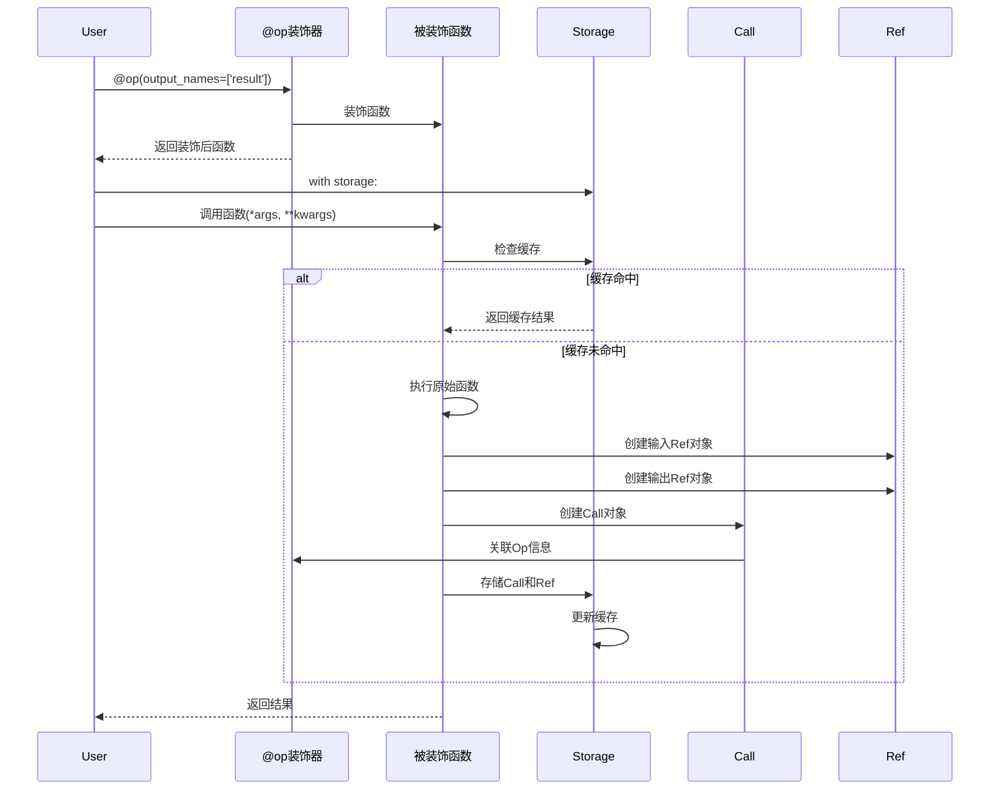
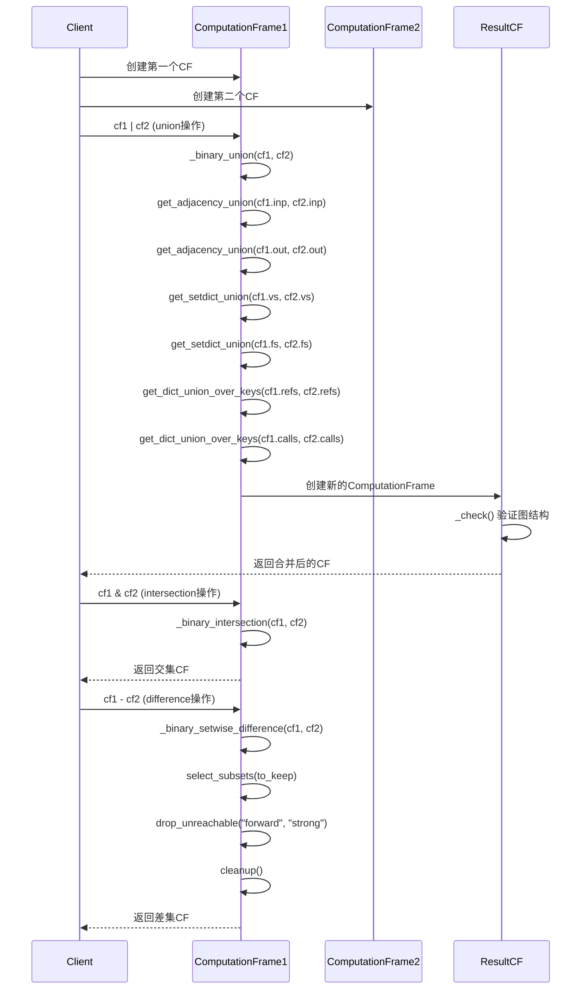

# Mandala框架序列图

## 1. 栈回放完整流程序列图

```mermaid
sequenceDiagram
    participant User
    participant StackReplayDemo as SRD
    participant Storage
    participant ComputationFrame as CF
    participant 批量计算 as BC
    participant 数据处理 as DP

    User->>SRD: 创建演示实例
    SRD->>Storage: 初始化存储
    
    User->>SRD: 运行完整演示()
    SRD->>SRD: 创建计算历史()
    
    SRD->>Storage: with storage:
    SRD->>BC: 批量计算(测试数据, 处理参数=2)
    
    loop 对每个输入列表
        BC->>DP: 数据处理(数据, 乘数)
        DP-->>BC: 处理结果
    end
    
    BC-->>SRD: 原始结果
    SRD->>Storage: cf(原始结果)
    Storage->>CF: 创建ComputationFrame
    CF->>CF: expand_back(recursive=True)
    CF-->>SRD: 扩展后的CF
    
    SRD->>SRD: 查找目标函数("数据处理")
    SRD->>CF: calls_by_func()["数据处理"]
    CF-->>SRD: 调用列表
    
    SRD->>SRD: 修改参数重新执行(调用, 新参数)
    SRD->>Storage: unwrap(ref) for 原始参数
    Storage-->>SRD: 原始参数值
    
    SRD->>Storage: with storage:
    SRD->>DP: 数据处理(**最终参数)
    DP-->>SRD: 新结果
    
    SRD->>SRD: 替换节点生成新CF(新结果)
    SRD->>Storage: cf(新结果)
    Storage->>CF: 创建新CF
    CF->>CF: expand_back(recursive=True)
    CF-->>SRD: 新CF
    
    SRD->>SRD: 合并ComputationFrame(原始cf, 新cf)
    SRD->>CF: 原始cf | 新cf
    CF-->>SRD: 合并后CF
    
    SRD->>SRD: 可视化结果(合并cf, "merged_computation")
    SRD->>CF: draw(path, orientation='TB')
    CF-->>SRD: SVG文件生成
    
    SRD->>SRD: 分析结果(原始结果, 新结果)
    SRD-->>User: 演示完成
```

## 2. ComputationFrame操作序列图

```mermaid
sequenceDiagram
    participant Client
    participant CF as ComputationFrame
    participant Storage
    participant Ref
    participant Call

    Client->>Storage: 创建Storage实例
    Client->>CF: 创建ComputationFrame
    CF->>Storage: 关联存储
    
    Client->>CF: add_ref(vname, ref)
    CF->>CF: vs[vname].add(ref.hid)
    CF->>CF: refs[ref.hid] = ref
    CF->>CF: refinv[ref.hid].add(vname)
    
    Client->>CF: add_call(fname, call, with_refs=True)
    CF->>CF: calls[call.hid] = call
    CF->>CF: fs[fname].add(call.hid)
    CF->>CF: callinv[call.hid].add(fname)
    
    loop 对每个输入
        CF->>CF: add_ref(input_vname, input_ref)
    end
    
    loop 对每个输出
        CF->>CF: add_ref(output_vname, output_ref)
        CF->>CF: creator[output_ref.hid] = call.hid
    end
    
    Client->>CF: expand_back(recursive=True)
    CF->>CF: _expand_unidirectional("back", recursive=True)
    
    loop 直到固定点
        CF->>Storage: 查找创建者调用
        Storage-->>CF: 返回调用列表
        CF->>CF: 添加新的函数和变量节点
        CF->>CF: 连接边关系
    end
    
    CF-->>Client: 扩展后的ComputationFrame
```

## 3. 函数装饰器和执行序列图

```mermaid
sequenceDiagram
    participant User
    participant Op as @op装饰器
    participant Function as 被装饰函数
    participant Storage
    participant Call
    participant Ref

    User->>Op: @op(output_names=['result'])
    Op->>Function: 装饰函数
    Op-->>User: 返回装饰后函数
    
    User->>Storage: with storage:
    User->>Function: 调用函数(*args, **kwargs)
    
    Function->>Storage: 检查缓存
    alt 缓存命中
        Storage-->>Function: 返回缓存结果
    else 缓存未命中
        Function->>Function: 执行原始函数
        Function->>Ref: 创建输入Ref对象
        Function->>Ref: 创建输出Ref对象
        Function->>Call: 创建Call对象
        Call->>Op: 关联Op信息
        Function->>Storage: 存储Call和Ref
        Storage->>Storage: 更新缓存
    end
    
    Function-->>User: 返回结果
```

## 4. 图操作序列图

```mermaid
sequenceDiagram
    participant Client
    participant CF1 as ComputationFrame1
    participant CF2 as ComputationFrame2
    participant Result as ResultCF

    Client->>CF1: 创建第一个CF
    Client->>CF2: 创建第二个CF
    
    Client->>CF1: cf1 | cf2 (union操作)
    CF1->>CF1: _binary_union(cf1, cf2)
    
    CF1->>CF1: get_adjacency_union(cf1.inp, cf2.inp)
    CF1->>CF1: get_adjacency_union(cf1.out, cf2.out)
    CF1->>CF1: get_setdict_union(cf1.vs, cf2.vs)
    CF1->>CF1: get_setdict_union(cf1.fs, cf2.fs)
    CF1->>CF1: get_dict_union_over_keys(cf1.refs, cf2.refs)
    CF1->>CF1: get_dict_union_over_keys(cf1.calls, cf2.calls)
    
    CF1->>Result: 创建新的ComputationFrame
    Result->>Result: _check() 验证图结构
    Result-->>Client: 返回合并后的CF
    
    Client->>CF1: cf1 & cf2 (intersection操作)
    CF1->>CF1: _binary_intersection(cf1, cf2)
    CF1-->>Client: 返回交集CF
    
    Client->>CF1: cf1 - cf2 (difference操作)
    CF1->>CF1: _binary_setwise_difference(cf1, cf2)
    CF1->>CF1: select_subsets(to_keep)
    CF1->>CF1: drop_unreachable("forward", "strong")
    CF1->>CF1: cleanup()
    CF1-->>Client: 返回差集CF
```