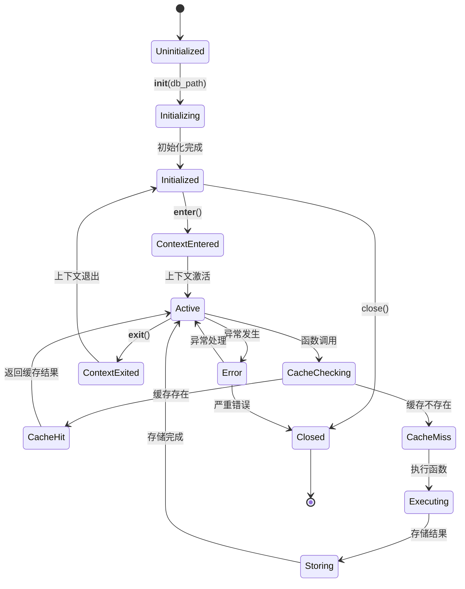
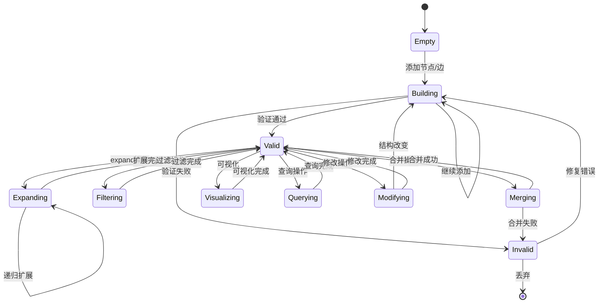
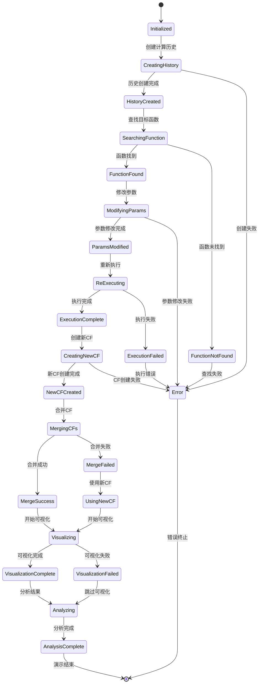
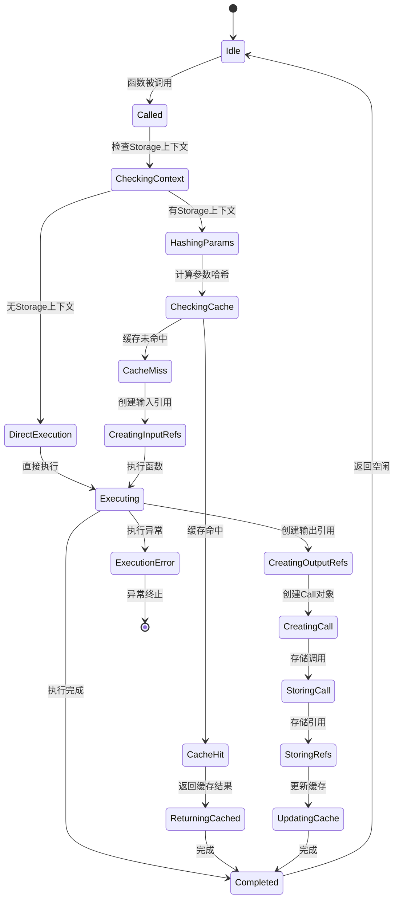
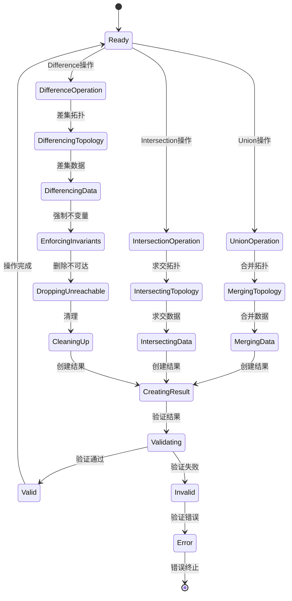
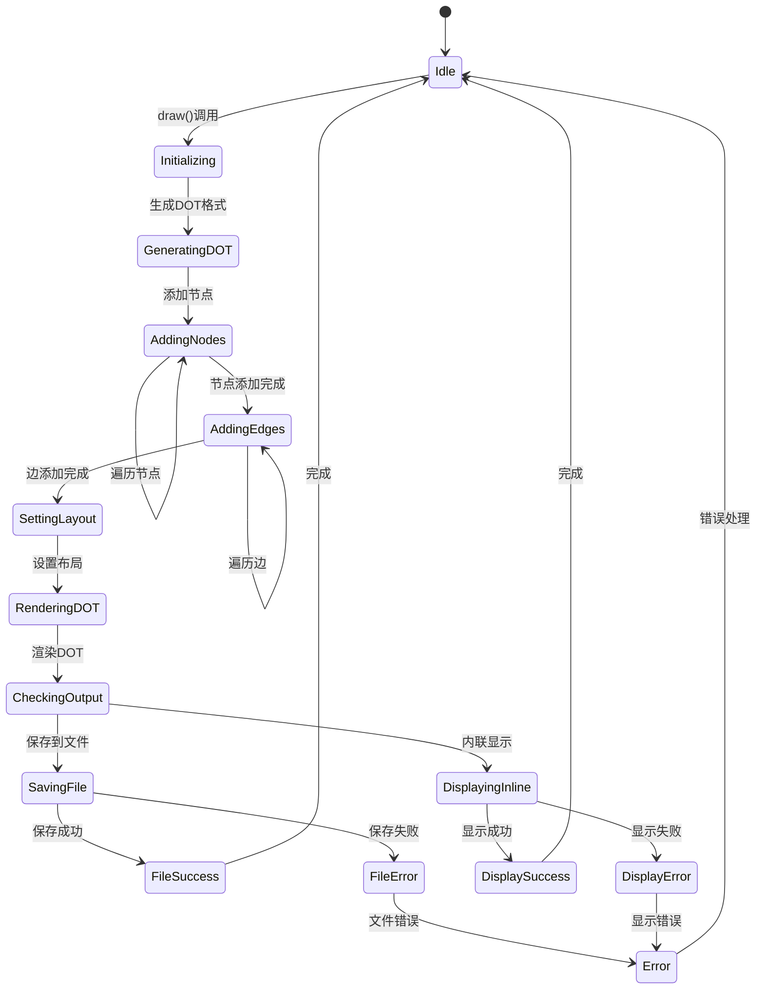

# Mandala框架状态图

## 1. Storage生命周期状态图

```mermaid
stateDiagram-v2
    [*] --> Uninitialized
    
    Uninitialized --> Initializing : __init__(db_path)
    Initializing --> Initialized : 初始化完成
    
    Initialized --> ContextEntered : __enter__()
    ContextEntered --> Active : 上下文激活
    
    Active --> CacheChecking : 函数调用
    CacheChecking --> CacheHit : 缓存存在
    CacheChecking --> CacheMiss : 缓存不存在
    
    CacheHit --> Active : 返回缓存结果
    CacheMiss --> Executing : 执行函数
    Executing --> Storing : 存储结果
    Storing --> Active : 存储完成
    
    Active --> ContextExited : __exit__()
    ContextExited --> Initialized : 上下文退出
    
    Initialized --> Closed : close()
    Closed --> [*]
    
    Active --> Error : 异常发生
    Error --> Active : 异常处理
    Error --> Closed : 严重错误
```

## 2. ComputationFrame状态图

```mermaid
stateDiagram-v2
    [*] --> Empty
    
    Empty --> Building : 添加节点/边
    Building --> Building : 继续添加
    Building --> Valid : 验证通过
    Building --> Invalid : 验证失败
    
    Invalid --> Building : 修复错误
    Invalid --> [*] : 丢弃
    
    Valid --> Expanding : expand操作
    Expanding --> Expanding : 递归扩展
    Expanding --> Valid : 扩展完成
    
    Valid --> Filtering : 过滤操作
    Filtering --> Valid : 过滤完成
    
    Valid --> Merging : 合并操作
    Merging --> Valid : 合并成功
    Merging --> Invalid : 合并失败
    
    Valid --> Visualizing : 可视化
    Visualizing --> Valid : 可视化完成
    
    Valid --> Querying : 查询操作
    Querying --> Valid : 查询完成
    
    Valid --> Modifying : 修改操作
    Modifying --> Building : 结构改变
    Modifying --> Valid : 修改完成
```

## 3. 栈回放系统状态图

```mermaid
stateDiagram-v2
    [*] --> Initialized
    
    Initialized --> CreatingHistory : 创建计算历史
    CreatingHistory --> HistoryCreated : 历史创建完成
    CreatingHistory --> Error : 创建失败
    
    HistoryCreated --> SearchingFunction : 查找目标函数
    SearchingFunction --> FunctionFound : 函数找到
    SearchingFunction --> FunctionNotFound : 函数未找到
    
    FunctionNotFound --> Error : 查找失败
    
    FunctionFound --> ModifyingParams : 修改参数
    ModifyingParams --> ParamsModified : 参数修改完成
    ModifyingParams --> Error : 参数修改失败
    
    ParamsModified --> ReExecuting : 重新执行
    ReExecuting --> ExecutionComplete : 执行完成
    ReExecuting --> ExecutionFailed : 执行失败
    
    ExecutionFailed --> Error : 执行错误
    
    ExecutionComplete --> CreatingNewCF : 创建新CF
    CreatingNewCF --> NewCFCreated : 新CF创建完成
    CreatingNewCF --> Error : CF创建失败
    
    NewCFCreated --> MergingCFs : 合并CF
    MergingCFs --> MergeSuccess : 合并成功
    MergingCFs --> MergeFailed : 合并失败
    
    MergeFailed --> UsingNewCF : 使用新CF
    UsingNewCF --> Visualizing : 开始可视化
    
    MergeSuccess --> Visualizing : 开始可视化
    Visualizing --> VisualizationComplete : 可视化完成
    Visualizing --> VisualizationFailed : 可视化失败
    
    VisualizationComplete --> Analyzing : 分析结果
    VisualizationFailed --> Analyzing : 跳过可视化
    
    Analyzing --> AnalysisComplete : 分析完成
    AnalysisComplete --> [*] : 演示结束
    
    Error --> [*] : 错误终止
```

## 4. 函数执行状态图

```mermaid
stateDiagram-v2
    [*] --> Idle
    
    Idle --> Called : 函数被调用
    Called --> CheckingContext : 检查Storage上下文
    
    CheckingContext --> DirectExecution : 无Storage上下文
    CheckingContext --> HashingParams : 有Storage上下文
    
    DirectExecution --> Executing : 直接执行
    Executing --> Completed : 执行完成
    
    HashingParams --> CheckingCache : 计算参数哈希
    CheckingCache --> CacheHit : 缓存命中
    CheckingCache --> CacheMiss : 缓存未命中
    
    CacheHit --> ReturningCached : 返回缓存结果
    ReturningCached --> Completed : 完成
    
    CacheMiss --> CreatingInputRefs : 创建输入引用
    CreatingInputRefs --> Executing : 执行函数
    Executing --> CreatingOutputRefs : 创建输出引用
    CreatingOutputRefs --> CreatingCall : 创建Call对象
    CreatingCall --> StoringCall : 存储调用
    StoringCall --> StoringRefs : 存储引用
    StoringRefs --> UpdatingCache : 更新缓存
    UpdatingCache --> Completed : 完成
    
    Executing --> ExecutionError : 执行异常
    ExecutionError --> [*] : 异常终止
    
    Completed --> Idle : 返回空闲
```

## 5. 图操作状态图

```mermaid
stateDiagram-v2
    [*] --> Ready
    
    Ready --> UnionOperation : Union操作
    Ready --> IntersectionOperation : Intersection操作
    Ready --> DifferenceOperation : Difference操作
    
    UnionOperation --> MergingTopology : 合并拓扑
    IntersectionOperation --> IntersectingTopology : 求交拓扑
    DifferenceOperation --> DifferencingTopology : 差集拓扑
    
    MergingTopology --> MergingData : 合并数据
    IntersectingTopology --> IntersectingData : 求交数据
    DifferencingTopology --> DifferencingData : 差集数据
    
    MergingData --> CreatingResult : 创建结果
    IntersectingData --> CreatingResult : 创建结果
    DifferencingData --> EnforcingInvariants : 强制不变量
    
    EnforcingInvariants --> DroppingUnreachable : 删除不可达
    DroppingUnreachable --> CleaningUp : 清理
    CleaningUp --> CreatingResult : 创建结果
    
    CreatingResult --> Validating : 验证结果
    Validating --> Valid : 验证通过
    Validating --> Invalid : 验证失败
    
    Valid --> Ready : 操作完成
    Invalid --> Error : 验证错误
    Error --> [*] : 错误终止
```

## 6. 可视化状态图

```mermaid
stateDiagram-v2
    [*] --> Idle
    
    Idle --> Initializing : draw()调用
    Initializing --> GeneratingDOT : 生成DOT格式
    
    GeneratingDOT --> AddingNodes : 添加节点
    AddingNodes --> AddingNodes : 遍历节点
    AddingNodes --> AddingEdges : 节点添加完成
    
    AddingEdges --> AddingEdges : 遍历边
    AddingEdges --> SettingLayout : 边添加完成
    
    SettingLayout --> RenderingDOT : 设置布局
    RenderingDOT --> CheckingOutput : 渲染DOT
    
    CheckingOutput --> SavingFile : 保存到文件
    CheckingOutput --> DisplayingInline : 内联显示
    
    SavingFile --> FileSuccess : 保存成功
    SavingFile --> FileError : 保存失败
    
    DisplayingInline --> DisplaySuccess : 显示成功
    DisplayingInline --> DisplayError : 显示失败
    
    FileSuccess --> Idle : 完成
    DisplaySuccess --> Idle : 完成
    
    FileError --> Error : 文件错误
    DisplayError --> Error : 显示错误
    Error --> Idle : 错误处理
```