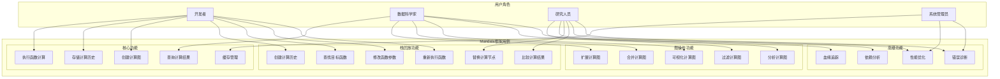
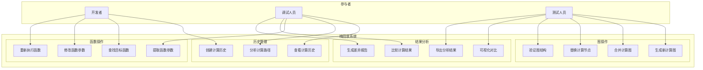
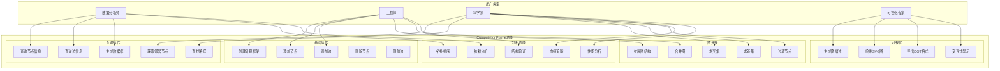
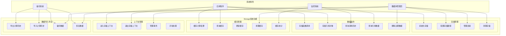
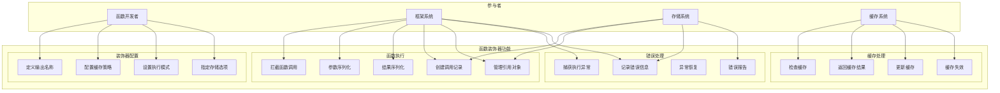
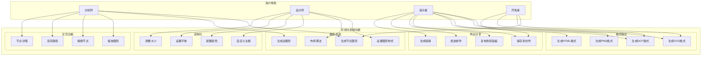

# Mandala框架用例图

## 1. 系统整体用例图

```mermaid
graph TB
    subgraph "Mandala框架用例"
        subgraph "核心功能"
            UC1[执行函数计算]
            UC2[存储计算历史]
            UC3[创建计算图]
            UC4[查询计算结果]
            UC5[缓存管理]
        end
        
        subgraph "图操作功能"
            UC6[扩展计算图]
            UC7[合并计算图]
            UC8[过滤计算图]
            UC9[可视化计算图]
            UC10[分析计算图]
        end
        
        subgraph "栈回放功能"
            UC11[创建计算历史]
            UC12[查找目标函数]
            UC13[修改函数参数]
            UC14[重新执行函数]
            UC15[替换计算节点]
            UC16[比较计算结果]
        end
        
        subgraph "高级功能"
            UC17[血缘追踪]
            UC18[依赖分析]
            UC19[性能优化]
            UC20[错误诊断]
        end
    end
    
    subgraph "用户角色"
        DEV[开发者]
        DATA_SCIENTIST[数据科学家]
        RESEARCHER[研究人员]
        ADMIN[系统管理员]
    end
    
    DEV --> UC1
    DEV --> UC2
    DEV --> UC3
    DEV --> UC11
    DEV --> UC12
    DEV --> UC13
    DEV --> UC14
    
    DATA_SCIENTIST --> UC4
    DATA_SCIENTIST --> UC6
    DATA_SCIENTIST --> UC7
    DATA_SCIENTIST --> UC9
    DATA_SCIENTIST --> UC17
    DATA_SCIENTIST --> UC18
    
    RESEARCHER --> UC8
    RESEARCHER --> UC10
    RESEARCHER --> UC15
    RESEARCHER --> UC16
    RESEARCHER --> UC19
    RESEARCHER --> UC20
    
    ADMIN --> UC5
    ADMIN --> UC19
    ADMIN --> UC20
```

## 2. 栈回放系统用例图

```mermaid
graph TB
    subgraph "栈回放系统"
        subgraph "历史管理"
            UC1[创建计算历史]
            UC2[查看计算历史]
            UC3[分析计算路径]
        end
        
        subgraph "函数操作"
            UC4[查找目标函数]
            UC5[提取函数参数]
            UC6[修改函数参数]
            UC7[重新执行函数]
        end
        
        subgraph "图操作"
            UC8[生成新计算图]
            UC9[合并计算图]
            UC10[替换计算节点]
            UC11[验证图结构]
        end
        
        subgraph "结果分析"
            UC12[比较计算结果]
            UC13[生成差异报告]
            UC14[可视化对比]
            UC15[导出分析结果]
        end
    end
    
    subgraph "参与者"
        DEVELOPER[开发者]
        DEBUGGER[调试人员]
        TESTER[测试人员]
    end
    
    DEVELOPER --> UC1
    DEVELOPER --> UC4
    DEVELOPER --> UC6
    DEVELOPER --> UC7
    
    DEBUGGER --> UC2
    DEBUGGER --> UC3
    DEBUGGER --> UC5
    DEBUGGER --> UC12
    DEBUGGER --> UC13
    
    TESTER --> UC8
    TESTER --> UC9
    TESTER --> UC10
    TESTER --> UC11
    TESTER --> UC14
    TESTER --> UC15
```

## 3. ComputationFrame用例图

```mermaid
graph TB
    subgraph "ComputationFrame功能"
        subgraph "基础操作"
            UC1[创建计算框架]
            UC2[添加节点]
            UC3[添加边]
            UC4[删除节点]
            UC5[删除边]
        end
        
        subgraph "查询操作"
            UC6[查询节点信息]
            UC7[查询边信息]
            UC8[获取邻居节点]
            UC9[查找路径]
            UC10[生成数据框]
        end
        
        subgraph "图变换"
            UC11[扩展图结构]
            UC12[合并图]
            UC13[求交集]
            UC14[求差集]
            UC15[过滤节点]
        end
        
        subgraph "分析功能"
            UC16[拓扑排序]
            UC17[依赖分析]
            UC18[血缘追踪]
            UC19[性能分析]
            UC20[结构验证]
        end
        
        subgraph "可视化"
            UC21[生成图描述]
            UC22[绘制SVG图]
            UC23[导出DOT格式]
            UC24[交互式显示]
        end
    end
    
    subgraph "用户类型"
        ANALYST[数据分析师]
        ENGINEER[工程师]
        SCIENTIST[科学家]
        VISUALIZER[可视化专家]
    end
    
    ANALYST --> UC6
    ANALYST --> UC7
    ANALYST --> UC10
    ANALYST --> UC16
    ANALYST --> UC17
    
    ENGINEER --> UC1
    ENGINEER --> UC2
    ENGINEER --> UC3
    ENGINEER --> UC11
    ENGINEER --> UC12
    ENGINEER --> UC20
    
    SCIENTIST --> UC8
    SCIENTIST --> UC9
    SCIENTIST --> UC13
    SCIENTIST --> UC14
    SCIENTIST --> UC15
    SCIENTIST --> UC18
    SCIENTIST --> UC19
    
    VISUALIZER --> UC21
    VISUALIZER --> UC22
    VISUALIZER --> UC23
    VISUALIZER --> UC24
```

## 4. Storage系统用例图

```mermaid
graph TB
    subgraph "Storage系统功能"
        subgraph "存储管理"
            UC1[初始化存储]
            UC2[配置存储路径]
            UC3[管理连接]
            UC4[清理存储]
        end
        
        subgraph "数据操作"
            UC5[存储函数调用]
            UC6[存储引用对象]
            UC7[查询调用历史]
            UC8[查询引用数据]
            UC9[删除过期数据]
        end
        
        subgraph "缓存管理"
            UC10[缓存计算结果]
            UC11[查询缓存]
            UC12[更新缓存]
            UC13[清理缓存]
            UC14[缓存统计]
        end
        
        subgraph "上下文管理"
            UC15[进入存储上下文]
            UC16[退出存储上下文]
            UC17[管理事务]
            UC18[异常处理]
        end
        
        subgraph "数据导入导出"
            UC19[导出计算历史]
            UC20[导入计算历史]
            UC21[备份数据]
            UC22[恢复数据]
        end
    end
    
    subgraph "系统角色"
        APP[应用程序]
        DBA[数据库管理员]
        MONITOR[监控系统]
        BACKUP[备份系统]
    end
    
    APP --> UC1
    APP --> UC5
    APP --> UC6
    APP --> UC10
    APP --> UC11
    APP --> UC15
    APP --> UC16
    
    DBA --> UC2
    DBA --> UC3
    DBA --> UC4
    DBA --> UC9
    DBA --> UC13
    DBA --> UC21
    DBA --> UC22
    
    MONITOR --> UC7
    MONITOR --> UC8
    MONITOR --> UC14
    MONITOR --> UC17
    
    BACKUP --> UC19
    BACKUP --> UC20
    BACKUP --> UC21
    BACKUP --> UC22
```

## 5. 函数装饰器用例图

```mermaid
graph TB
    subgraph "函数装饰器功能"
        subgraph "装饰器配置"
            UC1[定义输出名称]
            UC2[配置缓存策略]
            UC3[设置执行模式]
            UC4[指定存储选项]
        end
        
        subgraph "函数执行"
            UC5[拦截函数调用]
            UC6[参数序列化]
            UC7[结果序列化]
            UC8[创建调用记录]
            UC9[管理引用对象]
        end
        
        subgraph "缓存处理"
            UC10[检查缓存]
            UC11[返回缓存结果]
            UC12[更新缓存]
            UC13[缓存失效]
        end
        
        subgraph "错误处理"
            UC14[捕获执行异常]
            UC15[记录错误信息]
            UC16[异常恢复]
            UC17[错误报告]
        end
    end
    
    subgraph "参与者"
        FUNC_DEV[函数开发者]
        FRAMEWORK[框架系统]
        STORAGE_SYS[存储系统]
        CACHE_SYS[缓存系统]
    end
    
    FUNC_DEV --> UC1
    FUNC_DEV --> UC2
    FUNC_DEV --> UC3
    FUNC_DEV --> UC4
    
    FRAMEWORK --> UC5
    FRAMEWORK --> UC6
    FRAMEWORK --> UC7
    FRAMEWORK --> UC8
    FRAMEWORK --> UC9
    FRAMEWORK --> UC14
    FRAMEWORK --> UC15
    
    STORAGE_SYS --> UC8
    STORAGE_SYS --> UC9
    STORAGE_SYS --> UC15
    STORAGE_SYS --> UC17
    
    CACHE_SYS --> UC10
    CACHE_SYS --> UC11
    CACHE_SYS --> UC12
    CACHE_SYS --> UC13
```

## 6. 可视化系统用例图

```mermaid
graph TB
    subgraph "可视化系统功能"
        subgraph "图形生成"
            UC1[生成节点图形]
            UC2[生成边图形]
            UC3[设置图形样式]
            UC4[布局算法]
        end
        
        subgraph "格式输出"
            UC5[生成SVG格式]
            UC6[生成PNG格式]
            UC7[生成DOT格式]
            UC8[生成HTML格式]
        end
        
        subgraph "交互功能"
            UC9[缩放图形]
            UC10[拖拽节点]
            UC11[高亮路径]
            UC12[节点详情]
        end
        
        subgraph "定制化"
            UC13[自定义主题]
            UC14[配置颜色]
            UC15[设置字体]
            UC16[调整大小]
        end
        
        subgraph "导出分享"
            UC17[保存到文件]
            UC18[复制到剪贴板]
            UC19[发送邮件]
            UC20[生成链接]
        end
    end
    
    subgraph "用户角色"
        ANALYST[分析师]
        DESIGNER[设计师]
        PRESENTER[演示者]
        DEVELOPER[开发者]
    end
    
    ANALYST --> UC1
    ANALYST --> UC2
    ANALYST --> UC9
    ANALYST --> UC10
    ANALYST --> UC11
    ANALYST --> UC12
    
    DESIGNER --> UC3
    DESIGNER --> UC4
    DESIGNER --> UC13
    DESIGNER --> UC14
    DESIGNER --> UC15
    DESIGNER --> UC16
    
    PRESENTER --> UC5
    PRESENTER --> UC6
    PRESENTER --> UC7
    PRESENTER --> UC8
    PRESENTER --> UC17
    PRESENTER --> UC18
    PRESENTER --> UC19
    PRESENTER --> UC20
    
    DEVELOPER --> UC1
    DEVELOPER --> UC5
    DEVELOPER --> UC7
    DEVELOPER --> UC17
```