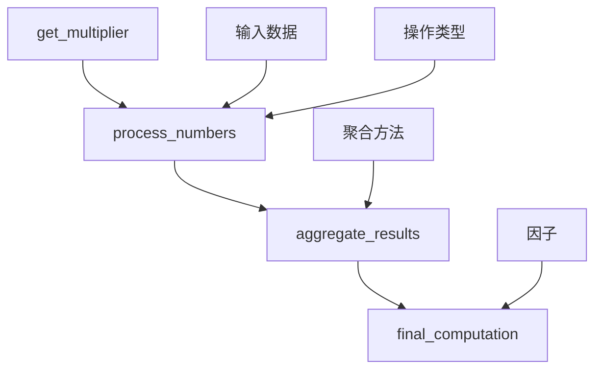
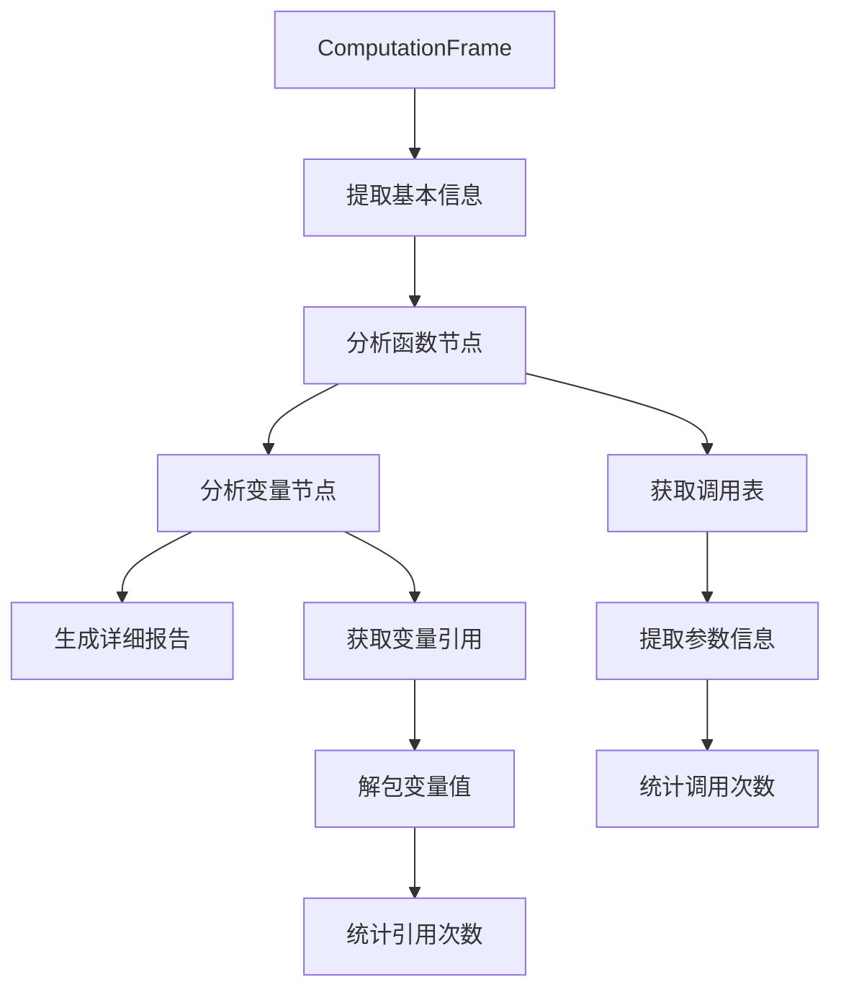
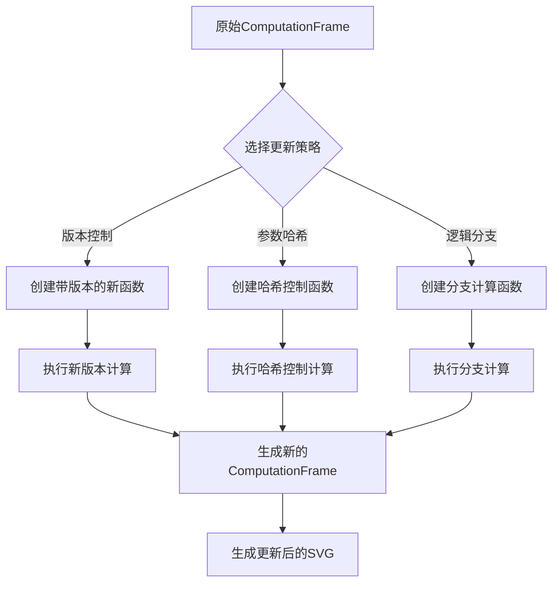

# ComputationFrame 节点操作综合示例

本文档详细介绍 `cf_node_manipulation_example.py` 的功能和实现原理。

## 功能概述

该示例整合了之前所有的 `ComputationFrame` 操作功能，提供了一个完整的节点操作工作流，包括：

1. **封装的函数管理**：统一管理 `@op` 和 `@track` 装饰的函数
2. **深度遍历分析**：全面分析 ComputationFrame 的结构和内容
3. **节点信息提取**：提取每个节点的详细信息和调用历史
4. **SVG 可视化**：生成计算图的 SVG 可视化文件
5. **节点更新策略**：实现三种不同的节点替换策略

## 核心类：ComputationFrameManager

### 初始化
```python
manager = ComputationFrameManager(storage_path=None)
```
- 如果 `storage_path` 为 None，使用内存存储
- 自动创建 `mydemo/svg/` 目录用于存储 SVG 文件

### 主要方法

#### 1. `create_computation_history()`
创建一个复杂的计算历史，包含：
- `@track` 函数：`get_multiplier()` - 获取配置参数
- `@op` 函数：`process_numbers()` - 处理数字列表
- `@op` 函数：`aggregate_results()` - 聚合计算结果
- `@op` 函数：`final_computation()` - 最终计算步骤

#### 2. `traverse_computation_frame(cf, detailed=True)`
遍历 ComputationFrame 并提取详细信息：
- **基本信息**：函数节点数、变量节点数、总节点数
- **函数详情**：每个函数的调用次数、参数列、样本数据
- **变量引用**：每个变量的引用次数和样本值

#### 3. `generate_svg_visualization(cf, filename, verbose=True)`
生成 ComputationFrame 的 SVG 可视化：
- 使用 `cf.draw()` 方法生成图形
- 自动保存到 `mydemo/svg/` 目录
- 支持详细信息显示

#### 4. `update_node_and_regenerate(original_cf, update_strategy)`
实现三种节点更新策略：

##### 策略一：版本控制 (`version_control`)
- 通过添加版本参数来区分不同的计算
- 创建 `enhanced_process_numbers()` 函数
- 使用版本字符串强制重新计算

##### 策略二：参数哈希 (`parameter_hash`)
- 通过哈希值控制计算的执行
- 创建 `hash_controlled_computation()` 函数
- 使用 `force_update` 参数强制更新

##### 策略三：逻辑分支 (`logic_branch`)
- 通过分支参数控制计算逻辑
- 创建 `branching_computation()` 函数
- 支持多种计算分支和增强级别

## 执行流程

### 1. 创建计算历史


### 2. 遍历分析流程


### 3. 节点更新流程


## 生成的文件

运行示例后，会在 `mydemo/svg/` 目录下生成以下 SVG 文件：

1. `original_computation_graph.svg` - 原始计算图
2. `updated_version_control_computation_graph.svg` - 版本控制策略更新后的图
3. `updated_parameter_hash_computation_graph.svg` - 参数哈希策略更新后的图
4. `updated_logic_branch_computation_graph.svg` - 逻辑分支策略更新后的图
5. `combined_computation_graph.svg` - 组合计算图

## 使用示例

```python
# 创建管理器
manager = ComputationFrameManager()

# 执行综合分析
manager.comprehensive_analysis()

# 或者分步执行
results = manager.create_computation_history()
cf = manager.storage.cf(manager.final_computation).expand_all()
info = manager.traverse_computation_frame(cf)
svg_path = manager.generate_svg_visualization(cf, "my_graph.svg")
```

## 技术特点

1. **封装性**：所有操作都封装在 `ComputationFrameManager` 类中
2. **可扩展性**：易于添加新的更新策略和分析方法
3. **可视化**：自动生成 SVG 文件便于理解计算图结构
4. **错误处理**：包含完善的异常处理机制
5. **灵活性**：支持内存存储和持久化存储

## 最佳实践

1. **开发阶段**：使用内存存储进行快速测试
2. **生产环境**：使用持久化存储保存计算历史
3. **调试时**：查看生成的 SVG 文件理解计算流程
4. **优化时**：使用遍历分析找出性能瓶颈
5. **重构时**：使用节点更新策略安全地修改计算逻辑

这个综合示例展示了 `mandala` 框架在计算图管理方面的强大能力，为复杂的计算流程提供了完整的解决方案。 